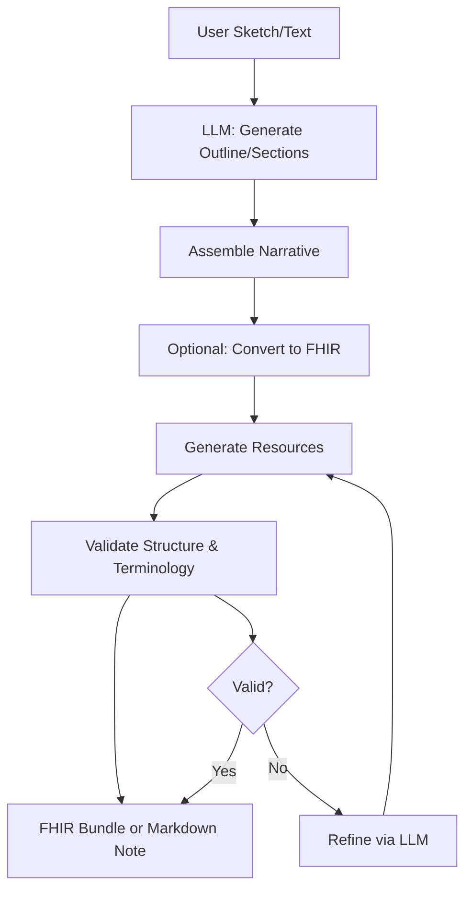

# 0. Kiln: Clinical Narrative From Raw Clay

This project implements a browser-based authoring environment for clinical notes, with server-side validation for FHIR structure and terminology. The system uses Bun.ts for the runtime (no Node.js dependency) and Java 17+ for the FHIR validator. Core mental model: authors start with a "sketch" (brief patient description) or raw text; the system generates structured narrative or FHIR resources via LLM prompts, then validates against FHIR R4 and canonical terminologies (LOINC, SNOMED CT, RxNorm).

Key points:
- Single codebase: UI, APIs, and validators integrated.
- No persistent storage: everything runs in-browser or ephemeral server; data is local or in-memory.
- Focus: rapid iteration from free-text input to FHIR-compliant output, emphasizing terminology accuracy and structural validity.

Built by Josh Mandel, MD.

## 1. Architecture

Kiln's architecture separates concerns into a modular client-server model, enabling flexible deployment from fully static (browser-only) to full-stack with server-side validation. The system emphasizes stateless processing: the client handles interactive authoring and LLM calls, while the server provides on-demand validation services. This design supports rapid prototyping and scales to production without requiring a persistent database for user data.

### Components

- **Client (Bun.ts + React)**: The browser-based interface for note authoring, using React for UI components and Bun.ts for bundling. It manages local state for sketches, outlines, and drafts, integrating directly with LLM providers (e.g., OpenAI via OpenRouter) for generation tasks. Configuration is handled via localStorage—no server-side env files are needed for API keys or model selection. The client can operate standalone for basic authoring, generating Markdown narratives or FHIR drafts locally, with optional server calls for validation.

- **Server (Bun.ts)**: A lightweight API server built with Bun.ts, serving the client UI in development mode (port 3000) and providing dedicated endpoints for validation (port 3500 in API-only mode). It runs the FHIR validator (a Java process) for structural conformance checks and maintains an SQLite database with FTS5 indexing for terminology search (LOINC, SNOMED CT, RxNorm, and FHIR code systems). The server is stateless, processing requests on-the-fly without user sessions.

- **External Dependencies**: 
  - Java 17+ is required for the HAPI FHIR validator JAR, which handles R4 conformance testing.
  - An LLM provider (e.g., OpenAI or OpenRouter) is called client-side for content generation.
  - Optional: A live FHIR server (e.g., HAPI or Azure) for advanced validation or storage; Kiln uses a configurable base URL (PUBLIC_KILN_FHIR_BASE_URL) for generating fullUrl references in bundles, but no runtime FHIR calls are made unless explicitly configured.

### Data Flow

The core workflow transforms unstructured input into validated outputs through iterative LLM calls and validation steps. It supports two primary paths: narrative generation (Markdown output) and FHIR conversion (Bundle output), with a refinement loop for the latter to ensure compliance.

- **Input**: A user provides a "sketch" (e.g., "52F with chest pain, onset 2 weeks ago") or raw clinical text. The client uses LLM prompts to generate an outline, then sections or a Composition plan.
- **Processing**: For narratives, sections are assembled into Markdown. For FHIR, the plan drives resource generation (e.g., Condition, Observation), followed by validation against FHIR R4 schemas and terminology canonicalization (e.g., mapping to LOINC/SNOMED).
- **Validation**: 
  - **Terminology**: Checks code existence and suggests canonical terms via SQLite FTS5 search.
  - **Structure**: Uses the HAPI validator for conformance, filtering noise (e.g., reference resolution warnings) and surfacing actionable issues.
- **Output**: 
  - Markdown narrative for human-readable notes.
  - FHIR Bundle (document type) with Composition as the root, including fullUrl entries pointing to a configurable FHIR base (e.g., kiln.fhir.me for static bundles or a live server for dynamic ones).

The refinement loop is key for FHIR: if validation fails, the LLM is prompted to patch issues (e.g., replace invalid codes), iterating until compliant or budget exhausted.



This diagram illustrates the pipeline's modularity: the client can skip server validation for quick authoring, while the server handles heavy lifting for production use. Bundles follow FHIR document standards, with Composition sections linking to resources via relative references resolved to fullUrl using the configured base (ensuring portability across servers).

## 2. Quick Start

### Prerequisites

Before getting started, ensure you have the following installed:

- **Bun 1.0+**: The JavaScript runtime and package manager used for this project. Install via [bun.sh](https://bun.sh/docs/installation).
- **Java 17+**: Required for the HAPI FHIR validator. Verify with `java -version`. If not installed, download from [Oracle](https://www.oracle.com/java/technologies/downloads/) or use a package manager like Homebrew (`brew install openjdk@17`).

No Node.js or other runtimes are needed—Bun handles everything.

### Steps

1. **Clone and Install Dependencies**:
   ```
   git clone <repo-url> kiln
   cd kiln
   bun install
   ```
   This installs all JavaScript dependencies for the client and server.

2. **Setup the Server**:
   ```
   cd server
   bun run scripts/setup.ts
   ```
   This script:
   - Downloads the latest HAPI FHIR validator JAR (~50MB).
   - Clones the `fhir-concept-publication-demo` repository as a submodule for vocabulary files (LOINC, SNOMED CT, RxNorm).
   - Creates necessary directories (`db/`, `tests/`).

   Troubleshooting: If Java is missing, you'll see an error like "java: command not found". Install Java and retry. For git issues, ensure git is installed (`git --version`).

3. **Load Terminology Database**:
   ```
   bun run scripts/load-terminology.ts
   ```
   This imports the large vocabulary files into an optimized SQLite database (`server/db/terminology.sqlite`, ~1-2GB). The process may take 5-10 minutes on first run as it processes NDJSON files. It's a one-time setup—future runs reuse the database.

   Notes: The database includes LOINC (lab/observations), SNOMED CT (clinical terms), RxNorm (medications), and FHIR code systems. If you add new vocabularies to `server/large-vocabularies/`, re-run this script. For troubleshooting, check console output for import errors (e.g., missing files).

4. **Run the Development Server**:
   ```
   bun run dev
   ```
   This starts the full-stack server at http://localhost:3000. The UI is available immediately, with APIs on the same port. Hot reload is enabled for rapid development.

   - Open http://localhost:3000 in your browser.
   - Author a note: Enter a patient sketch (e.g., "52F with chest pain, onset 2 weeks ago") and generate narrative or FHIR.
   - Validate: Click to generate and validate—watch console for LLM calls and errors.

   Troubleshooting: 
   - If port 3000 is in use, set `PORT=3001` and run again.
   - Java validator startup takes ~30 seconds; check logs for "Validator server ready".
   - For API-only mode: `cd server && bun run dev` (runs on port 3500; access UI separately).

5. **Test the Setup**:
   - Run tests: `bun test` (unit + integration for client/server).
   - Validate config: `bun run scripts/validate-env.ts` (checks PUBLIC_KILN_* vars).
   - Health check: `curl http://localhost:3000/health` (should return `{status: 'ok'}`).

### Notes

- **Terminology Loading**: This is a one-time step after setup or vocabulary updates. The SQLite database is self-contained and optimized with FTS5 for fast searches. Back it up if needed (`cp server/db/terminology.sqlite backup.sqlite`).
- **Docker for Development**: No Docker required for local dev, but a Dockerfile is provided for containerized runs (e.g., `docker build -t kiln . && docker run -p 3000:3500 kiln`). Use `-e` flags for env vars.
- **Production Builds**: For deployment, run `bun run build` to generate a static site in `dist/` (includes injected config). Serve with any static server (e.g., `npx serve dist -l 3001 --cors`).

## 3. Configuration

All configuration for Kiln is handled via environment variables prefixed with `PUBLIC_KILN_`. These are used at build time to generate a static `config.json` file injected into the HTML. Client-side settings (e.g., API keys) are managed per-browser via localStorage—no server-side storage is involved. This approach keeps the app lightweight and secure, with no need for `.env` files in production (except for server deployment).

### Key Variables

- **PUBLIC_KILN_LLM_URL** (required): The endpoint for your LLM provider. For example, `https://openrouter.ai/api/v1` (OpenRouter) or `https://api.openai.com/v1` (direct OpenAI). This must be a valid HTTPS URL. The client will append paths like `/chat/completions` for LLM calls.

- **PUBLIC_KILN_MODEL** (required): The model identifier in "provider/model" format. Examples: `openai/gpt-4o-mini` (OpenAI via OpenRouter), `meta-llama/llama-3.1-8b-instruct:free` (Llama via OpenRouter). Must match your provider's naming convention.

- **PUBLIC_KILN_TEMPERATURE** (optional, default 0.8): Controls LLM creativity. Range: 0.0 (deterministic) to 2.0 (more varied). Values outside 0-2 are clamped. Useful for narrative generation (higher for creative sketches) vs. FHIR (lower for precision).

- **PUBLIC_KILN_LLM_REQUEST_OPTIONS** (optional, default `{}`): JSON blob merged into each `/chat/completions` request. Use this to enable provider-specific features like OpenRouter's reasoning API (`{"reasoning":{"enabled":true}}`). Must decode to a JSON object.

- **PUBLIC_KILN_FHIR_BASE_URL** (required): The base URL for generating `fullUrl` in FHIR Bundles (e.g., `https://kiln.fhir.me` or your live FHIR server). This ensures valid references in static bundles; no runtime calls are made unless configured. Must start with `http://` or `https://`.

- **PUBLIC_KILN_VALIDATION_SERVICES_URL** (optional, default empty): URL for a remote FHIR validator (e.g., `https://your-fhir-server/validate`). If empty, the app auto-detects same-origin (e.g., `/validate` on the server). Use for advanced profiles or live server validation.

- **PUBLIC_KILN_FHIR_GEN_CONCURRENCY** (optional, default 1): Number of parallel threads for generating/refining FHIR resources (1-8). Higher values speed up batch processing but increase LLM load. Set to 1 for low-resource environments.

- **PUBLIC_KILN_MAX_RETRIES** (optional, default 3): Maximum retries for LLM calls (1-10). Useful for handling rate limits or transient errors.

- **PUBLIC_KILN_LLM_MAX_CONCURRENCY** (optional, default auto): Maximum concurrent LLM requests (auto-scales based on `PUBLIC_KILN_FHIR_GEN_CONCURRENCY`). Adjust for your provider's limits.

- **PUBLIC_KILN_DEBUG_MODE** (optional, default false): Enables verbose logging in browser console and server. Set to `true` for development.

### Validation Script

Run `bun run scripts/validate-env.ts` to check your environment. It generates a preview config and flags issues:

```
🔍 Validating environment for Kiln...

📋 Generated Configuration Preview:
==================================================
Environment: development
Source: runtime
Version: 1.0

LLM Base URL: https://openrouter.ai/api/v1
Model: openai/gpt-4o-mini
Temperature: 0.8

FHIR Base URL: https://kiln.fhir.me
Validation Services: [auto-detect]
FHIR Concurrency: 1

Debug Mode: false
Max Retries: 3
LLM Max Concurrency: 4

Generated: 10/15/2024, 3:45:00 PM

==================================================
✅ All validations passed!

🚀 Ready to build or deploy

💡 Commands:
   bun run dev              # Development server
   bun run build            # Production static build
   bun run preview          # Production server
   bun run serve:static     # Serve static build
```

If issues are found (e.g., missing URLs), it will list them and suggest fixes.

### Notes

- **Client vs. Server Config**: Environment variables configure the server and build process (e.g., base URLs for bundles). API keys and model selection are set in-browser via localStorage—each user configures independently. This avoids exposing sensitive data in builds.
- **Build-Time Injection**: On `bun run build`, all `PUBLIC_KILN_*` vars are baked into `dist/config.json` and injected as `window.STATIC_CONFIG` for offline use. No runtime env vars are needed post-build.
- **Model Naming**: Use full paths like `openai/gpt-4o-mini` for OpenRouter or `gpt-4o-mini` for direct OpenAI. Check your provider's docs for exact formats.
- **Example .env File**: Create `.env.local` (git-ignored) with your settings:

  ```
  PUBLIC_KILN_LLM_URL=https://openrouter.ai/api/v1
  PUBLIC_KILN_MODEL=openai/gpt-4o-mini
  PUBLIC_KILN_TEMPERATURE=0.7
  PUBLIC_KILN_LLM_REQUEST_OPTIONS={"reasoning":{"enabled":true}}
  PUBLIC_KILN_FHIR_BASE_URL=https://kiln.fhir.me
  PUBLIC_KILN_VALIDATION_SERVICES_URL=
  PUBLIC_KILN_FHIR_GEN_CONCURRENCY=2
  PUBLIC_KILN_MAX_RETRIES=3
  PUBLIC_KILN_LLM_MAX_CONCURRENCY=4
  PUBLIC_KILN_DEBUG_MODE=true
  ```

  Source from `.env.example` and customize. For production, set vars before building (e.g., via CI/CD).

- **Security**: Never commit `.env.local` (git-ignored). In production, use platform secrets (e.g., Vercel env vars) for build-time config. Client-side localStorage is per-device and not shared.

## 4. Running the App

Kiln supports flexible execution modes, from local development with hot reload to production deployments. The default setup uses Bun for both the client and server, with no additional runtimes required beyond Java 17+ for validation. All modes assume you've completed the setup steps (install, server setup, terminology loading).

### Development

For local development, use Bun's built-in hot reload to iterate quickly. The server bundles the UI and APIs, making it easy to test the full workflow.

- **Full Stack (Recommended)**: 
  ```
  bun run dev
  ```
  This launches a single server at http://localhost:3000, serving the React UI with proxied API calls to the internal validator (port 3500). Hot reload is enabled for both client and server changes—edit TypeScript files and see updates instantly in the browser. The validator starts asynchronously (~30 seconds); use the health endpoint (`curl http://localhost:3000/health`) to confirm readiness. This mode is ideal for end-to-end testing: author sketches, generate narratives/FHIR, and validate in one place.

- **API Only**:
  ```
  cd server
  bun run dev
  ```
  This runs the server on http://localhost:3500 without the UI. Use it for headless testing or integration with external clients. Access the UI separately by serving the built static files (e.g., `npx serve . -l 3000 --cors` from the root) and pointing it to the API at http://localhost:3500. Useful for API-focused development or when running the UI on a different port.

In development, the server logs to the console (set `PUBLIC_KILN_DEBUG_MODE=true` for verbose output). Client config (e.g., API keys) is set in-browser via localStorage—changes persist across reloads but clear in incognito/private mode.

### Production

For production, build a static bundle for deployment or run a server instance. Static mode is recommended for simplicity (no runtime server needed), while server mode suits environments requiring custom validation.

- **Static Build**:
  ```
  bun run build
  ```
  This generates a self-contained `dist/` directory with the complete app, including injected configuration from environment variables. The build:
  - Compiles TypeScript/React to optimized JS/CSS.
  - Embeds `config.json` as `window.STATIC_CONFIG` for offline use.
  - Copies public assets and examples.
  - Validates the output (required files, config integrity).

  The result is a fully static site deployable to any CDN or static host (Netlify, Vercel, GitHub Pages, S3). No server is needed post-build—the client handles LLM calls directly and uses local validation if no server is available.

- **Serve Static Build**:
  ```
  bun run serve:static
  ```
  Or use any static server:
  ```
  npx serve dist -l 3001 --cors
  python -m http.server 3001 dist/
  ```
  This serves the built app locally for testing. For production, deploy `dist/` to your preferred platform. Ensure CORS is enabled if the app calls external APIs (e.g., LLM providers). The app auto-detects the server for validation (same-origin `/validate`) or falls back to client-side checks.

- **Server Mode**:
  ```
  bun run preview
  ```
  This runs the production server on http://localhost:3500 (API + UI proxy). It's optimized for performance but requires the runtime environment (Bun + Java). Use for deployments where dynamic validation is needed (e.g., custom profiles or high-volume processing). Scale by running multiple instances behind a load balancer.

### Docker

Docker simplifies deployment across environments, bundling Bun, Java, and the pre-loaded terminology database. The provided Dockerfile creates a minimal image (~200MB) with the server running on port 3500.

- **Build**:
  ```
  docker build -t kiln .
  ```
  This builds the image, including:
  - Pre-loaded SQLite database (LOINC/SNOMED/RxNorm).
  - Validator JAR and Java runtime.
  - All dependencies installed.

- **Run**:
  ```
  docker run -p 3000:3500 kiln
  ```
  Access the UI at http://localhost:3000 (proxies to internal API). The container is stateless—scale horizontally with replicas.

- **With Environment Variables**:
  ```
  docker run \
    -e PUBLIC_KILN_LLM_URL=https://openrouter.ai/api/v1 \
    -e PUBLIC_KILN_MODEL=openai/gpt-4o-mini \
    -e PUBLIC_KILN_FHIR_BASE_URL=https://your-fhir-server \
    -p 3000:3500 \
    kiln
  ```
  Set vars for custom config. For static builds in Docker, mount `dist/` and serve with nginx (see Dockerfile comments).

Notes: Port 3000 is for the UI (with API proxy); port 3500 is the raw API. In Docker, the container runs as non-root (UID 1000) for security. Use volumes for persistent logs (`-v /host/logs:/app/logs`). For Kubernetes, expose 3500 as the service port and 3000 for UI ingress.

### Notes

- **Port Usage**: Development uses port 3000 for the full app (UI + proxied APIs). API-only mode uses 3500 directly. In production static mode, serve on any port—the app detects the server via same-origin `/health`. Avoid conflicts by setting `PORT=3001` (applies to both dev and preview).
- **LocalStorage for Client Config**: API keys, model selection, and session settings are stored in browser localStorage. They persist across reloads but clear in incognito/private browsing mode. For multi-user setups, each browser instance is isolated—no shared state.
- **Validator Startup**: The Java validator takes ~30 seconds to initialize on first run. Monitor logs for "Validator server ready" and use `/health` to confirm. In Docker, the image includes a healthcheck for this.
- **Performance**: Static builds are ~5MB gzipped (fast CDN delivery). Server mode uses in-memory SQLite (handles 1000+ concurrent searches). For high load, consider read replicas or external validators (configure via PUBLIC_KILN_VALIDATION_SERVICES_URL).

## 5. API Endpoints

The server exposes a unified API for terminology search and FHIR validation, designed for stateless, on-demand use. All endpoints are prefixed with `/api` by default (configurable via server options) and support CORS (origin: `*` by default). The API uses JSON for requests/responses and is optimized for batch operations to reduce round trips. Base URL in development: http://localhost:3500/api. For production, adjust the port and ensure HTTPS.

No authentication is required—intended for development and trusted environments. The backend uses SQLite with FTS5 indexing for fast terminology lookups and the HAPI FHIR validator (Java) for structural checks. Requests are processed asynchronously; large batches may take 1-30 seconds depending on complexity.

### Terminology Search (/tx/*)

These endpoints handle code lookups across loaded vocabularies (LOINC, SNOMED CT, RxNorm, and FHIR systems). Searches are fuzzy and ranked by relevance, supporting batch queries for efficiency.

- **`POST /tx/search`**  
  Performs full-text search for clinical terms, returning ranked hits from specified systems. Ideal for autocompletion or terminology suggestions during authoring.  
  **Body** (JSON):  
  ```json
  {
    "queries": ["diabetes", "hypertension"],  // Required: Array of search terms (1-10 recommended)
    "systems": ["http://loinc.org", "http://snomed.info/sct"],  // Optional: Filter by system URLs
    "limit": 20  // Optional: Max results per query (default 20, max 200)
  }
  ```  
  **Response** (JSON):  
  ```json
  {
    "results": [
      {
        "query": "diabetes",
        "hits": [
          {
            "system": "http://loinc.org",
            "code": "LA10529-8",
            "display": "Diabetes",
            "score": -9.57
          }
        ],
        "count": 25,
        "fullSystem": false,  // True if all results are from a small system (complete list)
        "guidance": "No matches found? Try broader terms."  // Optional: Search tips
      }
    ],
    "count": 2  // Number of queries processed
  }
  ```  
  **Example (curl)**:  
  ```
  curl -X POST http://localhost:3500/api/tx/search \
    -H "Content-Type: application/json" \
    -d '{"queries": ["diabetes"], "systems": ["http://snomed.info/sct"], "limit": 10}'
  ```  
  Notes: Scores are BM25 relevance (negative = higher rank). For small systems (<200 concepts), `fullSystem: true` indicates a complete list. Guidance appears for zero/low results.

- **`POST /tx/codes/exists`**  
  Checks if specific codes exist in the loaded vocabularies, with canonical display and normalization. Useful for validating user-entered codes or batch checks during FHIR generation.  
  **Body** (JSON):  
  ```json
  {
    "items": [
      {"system": "http://loinc.org", "code": "2345-7"},
      {"system": "http://snomed.info/sct", "code": "38341003"}
    ]
  }
  ```  
  **Response** (JSON):  
  ```json
  {
    "results": [
      {
        "system": "http://loinc.org",
        "code": "2345-7",
        "exists": true,
        "display": "Glucose [Mass/volume] in Serum or Plasma",
        "normalizedSystem": "http://loinc.org"
      },
      {
        "system": "http://snomed.info/sct",
        "code": "38341003",
        "exists": true,
        "display": "Hypertensive disorder, systemic arterial (disorder)",
        "normalizedSystem": "http://snomed.info/sct"
      }
    ]
  }
  ```  
  **Example (curl)**:  
  ```
  curl -X POST http://localhost:3500/api/tx/codes/exists \
    -H "Content-Type: application/json" \
    -d '{"items": [{"system": "http://loinc.org", "code": "2345-7"}]}'
  ```  
  Notes: `normalizedSystem` resolves aliases (e.g., "loinc" → "http://loinc.org"). Empty display means no preferred term found. Batch up to 100 items for efficiency.

- **`GET /tx/capabilities`**  
  Returns metadata about supported code systems, including sizes for query planning. No body required.  
  **Response** (JSON):  
  ```json
  {
    "supportedSystems": [
      "http://loinc.org",
      "http://snomed.info/sct",
      "http://www.nlm.nih.gov/research/umls/rxnorm"
    ],
    "bigSystems": [
      "http://snomed.info/sct",
      "http://loinc.org"
    ],
    "builtinFhirCodeSystems": [
      "http://hl7.org/fhir/CodeSystem/administrative-gender"
    ]
  }
  ```  
  **Example (curl)**:  
  ```
  curl http://localhost:3500/api/tx/capabilities
  ```  
  Notes: Use `bigSystems` to avoid exhaustive searches on large vocabularies (>500 concepts). `builtinFhirCodeSystems` lists native FHIR terms (e.g., for enums).

### Validation (/validate/*)

These endpoints validate FHIR resources against R4 schemas and profiles, filtering noise for actionable feedback. Supports single and batch modes.

- **`POST /validate`**  
  Validates a single FHIR resource, optionally against a profile. Returns conformance issues with severity and location.  
  **Body** (JSON):  
  ```json
  {
    "resource": { "resourceType": "Patient", "id": "example", ... },
    "profile": "http://hl7.org/fhir/StructureDefinition/Patient"  // Optional: Profile URL
  }
  ```  
  **Response** (JSON):  
  ```json
  {
    "valid": true,
    "issues": [
      {
        "severity": "error",
        "code": "required",
        "details": "Field 'name' is required",
        "location": "Patient.name"
      }
    ],
    "raw": "{...}"  // Optional: Full OperationOutcome for debugging
  }
  ```  
  **Example (curl)**:  
  ```
  curl -X POST http://localhost:3500/api/validate \
    -H "Content-Type: application/fhir+json" \
    -d '{"resourceType":"Patient","id":"example","name":[{"use":"official","family":"Doe","given":["John"]}], "gender":"male", "birthDate":"1990-01-01"}'
  ```  
  Notes: `raw` contains the full HAPI OperationOutcome. Severity: "error"/"fatal" (blocking), "warning"/"information" (advisory). Locations use JSONPath (e.g., "Patient.name[0].family"). For profiles, use full URLs (e.g., IPS).

- **`POST /validate/batch`**  
  Validates multiple resources in one request, returning per-resource results. Efficient for validating generated bundles or batches.  
  **Body** (JSON):  
  ```json
  {
    "resources": [
      {
        "id": "patient-1",
        "resource": { "resourceType": "Patient", ... },
        "profile": "http://hl7.org/fhir/StructureDefinition/Patient"
      }
    ]
  }
  ```  
  **Response** (JSON):  
  ```json
  {
    "results": [
      {
        "id": "patient-1",
        "valid": true,
        "issues": [],
        "raw": "{...}"
      }
    ]
  }
  ```  
  **Example (curl)**:  
  ```
  curl -X POST http://localhost:3500/api/validate/batch \
    -H "Content-Type: application/fhir+json" \
    -d '{"resources":[{"id":"example","resourceType":"Patient","id":"example","name":[{"use":"official","family":"Doe","given":["John"]}], "gender":"male", "birthDate":"1990-01-01"}]}'
  ```  
  Notes: Up to 50 resources per batch (for performance). Each result includes the input `id` for correlation. Use for validating entire Bundles by passing entries as array items.

### Health Check (/health)

- **`GET /health`**  
  Checks server status and service readiness. No body required.  
  **Response** (JSON):  
  ```json
  {
    "status": "ok",
    "services": {
      "terminology": true,
      "validator": {
        "ready": true
      }
    }
  }
  ```  
  **Example (curl)**:  
  ```
  curl http://localhost:3500/api/health
  ```  
  Notes: Use for liveness/readiness probes in production. `validator.ready` may be false during the initial 30-second startup. If false, retry after 10-60 seconds.

### Notes

- **CORS Support**: All endpoints allow cross-origin requests (`Access-Control-Allow-Origin: *`). For production, restrict origins via server options (e.g., `--cors-origin=yourdomain.com`).
- **Error Handling**: Invalid requests return 400 with `{error: "message"}`. Server errors are 500 with details. Always check `valid` and `issues` arrays.
- **Performance**: Terminology searches are sub-second (FTS5-optimized SQLite). Validation takes 100ms-10s per resource (Java overhead). Batch endpoints reduce latency for multiple items.
- **Backend**: SQLite (no auth, dev-only) powers terminology; HAPI FHIR validator handles structure. No user data is stored—requests are stateless.
- **Limitations**: Dev server has no rate limiting; add via reverse proxy (nginx) for prod. Validator is single-threaded; scale with multiple server instances.
- **Extensibility**: Add endpoints in `server/src/api.ts`. For custom vocabularies, extend `SqliteTerminologySearch` and update the schema.

## 6. Development

Kiln's development workflow leverages Bun's fast tooling for a seamless full-stack experience. The project uses TypeScript for type safety, React for the UI, and a modular structure to separate client authoring from server validation. All changes (UI, server, tests) can be iterated on with hot reload, and the setup emphasizes simplicity—no complex build pipelines or multiple runtimes.

### Workflow

- **Editor**: Use VS Code with the official Bun extension for syntax highlighting, debugging, and integrated terminal support. The extension provides Bun-specific features like fast test running and hot reload integration. Install it from the VS Code marketplace for optimal experience.

- **Hot Reload**: The `bun run dev` command enables hot reload for both the client (React) and server (Bun runtime). Changes to TypeScript files, components, or server endpoints trigger automatic restarts or recompiles. For ultra-fast iteration, use `bun --hot` in the dev script (already enabled)—it watches the entire project and reloads in under 100ms for most changes. Client-side updates appear instantly in the browser; server changes require a quick page refresh.

- **Testing**: Run `bun test` to execute the test suite, which covers unit tests for LLM prompts, validation logic, and integration tests for the terminology search and FHIR generation pipelines. The suite uses Bun's built-in test runner with TypeScript support out-of-the-box. For watch mode during development, use `bun test --watch` to re-run tests on file changes. Tests focus on edge cases like invalid FHIR resources, terminology mismatches, and LLM response parsing. Coverage is targeted at 90%+ for critical paths (validation, search).

- **Linting/Formatting**: Prettier is configured for consistent code style across TypeScript, JSX, JSON, and Markdown files. Run `bun run format` to auto-format the entire codebase before committing. For checking without fixing, use `bun run format:check`. ESLint is not enforced but can be added via `bun add -D eslint` if desired—focus remains on Prettier for simplicity.

- **Debug**: Enable verbose logging by setting `PUBLIC_KILN_DEBUG_MODE=true` in your environment (or via the browser's localStorage). This outputs detailed LLM prompts, validation traces, and server events to the browser console and server logs. Use Chrome DevTools for client-side debugging (React components, localStorage inspection). For server-side, attach Bun's debugger with `bun --inspect` and connect via Chrome (`chrome://inspect`). Watch for validator startup logs (~30s delay) and use `/health` to confirm readiness.

### Building

- **Static Build**: Execute `bun run build` to create an optimized production bundle in the `dist/` directory. This command:
  - Compiles TypeScript and React to minified JS/CSS.
  - Generates and injects `config.json` (from PUBLIC_KILN_* vars) as `window.STATIC_CONFIG` for offline use.
  - Copies public assets (CSS, images) and examples.
  - Validates the output: checks for required files (`config.json`, `index.html`, `viewer.html`) and config integrity (e.g., valid URLs).
  - Produces a self-contained site (~5MB gzipped) ready for CDN deployment.

  The build is ESM-only for modern browsers, with source maps for debugging (disabled in production). For development builds (non-minified), use `bun run build:dev`.

- **Validate Build**: Run `bun run build:validate` to check environment variables without generating files. It simulates the build process, flags missing/invalid PUBLIC_KILN_* vars, and previews the config. Use this before production builds to catch issues early (e.g., malformed URLs).

### Notes

- **Bun-Specific Tips**: Bun's `--hot` flag (enabled in `dev`) provides sub-second reloads for TypeScript changes—faster than Node.js watchers. Use `bun --bun run dev` for even quicker starts. For TypeScript errors, Bun reports them inline; fix with `bun run format` to auto-resolve common issues. If you encounter Bun-specific quirks (e.g., with JSX), ensure `tsconfig.json` has `"jsx": "react-jsx"`.

- **Terminology Rebuilds**: After updating vocabularies in `server/large-vocabularies/` (e.g., adding new NDJSON.gz files), re-run `bun run server/scripts/load-terminology.ts` to rebuild the SQLite database. This script processes files into an FTS5-optimized index for fast searches. It's idempotent but takes 5-10 minutes for large imports (LOINC/SNOMED/RxNorm). Back up `server/db/terminology.sqlite` before changes.

- **Adding New Vocabularies**: To extend terminology support:
  1. Place NDJSON.gz files in `server/large-vocabularies/` (format: first line = CodeSystem resource, subsequent lines = concepts with `code`, `display`, `designation[]`).
  2. Update `server/scripts/load-terminology.ts` to include the new system (add to `loadVocabularies()` or `loadNDJSON()` calls).
  3. Re-run the loader: `bun run server/scripts/load-terminology.ts`.
  4. Test with `bun test` (add cases to `tests/terminology.test.ts`).

  For custom vocabularies, ensure the CodeSystem URL is canonical (e.g., `http://your-system.org`). The loader handles up to 10MB files efficiently; larger ones may need batching. See `server/large-vocabularies/` for examples (LOINC, SNOMED CT, RxNorm).

- **Performance Tuning**: In development, the server uses in-memory SQLite for speed. For large-scale testing, monitor Java heap usage (`VALIDATOR_HEAP=4g` env var) and consider external validators for high concurrency. Client-side LLM calls are throttled via `PUBLIC_KILN_LLM_MAX_CONCURRENCY` to respect provider limits.

## 7. Deployment

Kiln supports two primary deployment modes: static (recommended for most use cases) and server-based. The static approach is ideal for simplicity and low overhead, as it requires no runtime server after building. Server mode is suited for environments needing dynamic validation, custom profiles, or integration with live FHIR services. Both modes leverage Bun's efficiency and the pre-built SQLite database for terminology, ensuring fast startup and low resource usage.

### Static (Recommended for Prod)

The static build mode compiles the entire application into a self-contained bundle in the `dist/` directory, embedding the configuration and assets. This is perfect for hosting on CDNs or static file servers, with no ongoing server requirements beyond serving the files. The app runs entirely in the browser, making LLM calls directly to your provider and using local validation fallbacks if no server is available.

- **Build**:
  ```
  bun run build
  ```
  This generates an optimized production bundle, including:
  - Minified JavaScript/CSS (ESM format for modern browsers).
  - Injected `config.json` as `window.STATIC_CONFIG` for offline configuration.
  - Copied assets (public/, examples/) and build metadata (`build-manifest.json`).
  - Validation of required files and config integrity.

  The output is ~5MB gzipped, loading quickly on any HTTPS-capable host. For development builds (non-minified, with source maps), use `bun run build:dev`.

- **Deploy**:
  Copy the `dist/` directory to your preferred static hosting platform:
  - **Netlify/Vercel**: Drag `dist/` to the dashboard or use CLI (`netlify deploy --dir dist` or `vercel --prod`).
  - **AWS S3**: Upload `dist/` to a public bucket with static website hosting enabled.
  - **GitHub Pages**: Push `dist/` to `gh-pages` branch or use Actions for automated builds.
  - **Other**: Any static server (nginx, Apache, Caddy) works—ensure CORS is configured for external LLM calls (e.g., OpenRouter).

  Access the app at your domain (e.g., https://your-domain.com). The UI handles all functionality, including validation via same-origin APIs if a server is present (auto-detected).

- **Custom Config**:
  Set `PUBLIC_KILN_*` environment variables before building to customize the bundle:
  ```
  export PUBLIC_KILN_LLM_URL=https://openrouter.ai/api/v1
  export PUBLIC_KILN_MODEL=openai/gpt-4o-mini
  export PUBLIC_KILN_FHIR_BASE_URL=https://your-fhir-server.com
  bun run build
  ```
  The config is baked in—re-build for changes. For multi-environment deploys (e.g., staging/prod), use CI/CD to set vars dynamically (e.g., GitHub Actions with secrets).

- **Subpath**:
  For deployment under a subdirectory (e.g., https://your-domain.com/kiln), set `PUBLIC_KILN_BASE_PATH=/kiln` (include trailing slash) before building. This adjusts asset paths and API prefixes. Re-build and redeploy to apply.

Notes: Static mode is serverless and scales infinitely via CDN. No Java or Bun runtime is needed post-deploy—the app uses browser APIs for LLM calls and local storage for user settings. For offline use, the bundle works without internet (except LLM calls), falling back to basic authoring without validation.

### Server Mode

Server mode runs the full application as a Bun process, serving the UI and handling API requests for validation and terminology. It's useful for custom integrations, advanced validation (e.g., with profiles), or high-volume processing. The server is lightweight and stateless, making it easy to scale.

- **Docker**:
  The provided Dockerfile creates a minimal, production-ready image (~200MB) with Bun, Java 17, and the pre-loaded terminology database. It runs the server on port 3500, with the UI proxied on port 3000.

  - **Build**:
    ```
    docker build -t kiln .
    ```
    This includes:
    - Pre-built SQLite database (~1-2GB, optimized with FTS5).
    - Validator JAR and Java runtime (heap tunable via VALIDATOR_HEAP).
    - All dependencies (no separate install needed).

  - **Run**:
    ```
    docker run -p 3000:3500 kiln
    ```
    Access the UI at http://localhost:3000 (proxies APIs internally). The container is non-root (UID 1000) for security and includes a healthcheck for readiness.

  - **With Environment Variables**:
    ```
    docker run \
      -e PUBLIC_KILN_LLM_URL=https://openrouter.ai/api/v1 \
      -e PUBLIC_KILN_MODEL=openai/gpt-4o-mini \
      -e PUBLIC_KILN_FHIR_BASE_URL=https://your-fhir-server \
      -e VALIDATOR_HEAP=4g \
      -p 3000:3500 \
      kiln
    ```
    Set vars for custom config. For persistent logs, mount a volume: `-v /host/logs:/app/logs`. Customize ports via `-e PORT=8080` (maps to container's 3500).

  - **Tweaks**:
    - **Custom Ports**: Edit Dockerfile `EXPOSE` and run with `-p your-port:3500`.
    - **Volumes**: Mount `./server/db/` for persistent terminology: `-v /host/db:/app/server/db`.
    - **Scaling**: Run multiple containers behind a load balancer (stateless server). Use Kubernetes with the healthcheck for orchestration.
    - **HTTPS**: The container serves HTTP; use a reverse proxy (nginx in front) for TLS termination. Example nginx config:
      ```
      server {
        listen 443 ssl;
        server_name your-domain.com;
        ssl_certificate /path/to/cert.pem;
        ssl_certificate_key /path/to/key.pem;

        location / {
          proxy_pass http://localhost:3500;
          proxy_set_header Host $host;
          proxy_set_header X-Real-IP $remote_addr;
        }
      }
      ```

Notes: Docker images are optimized for low memory (~512MB RAM recommended). The validator starts in ~30 seconds—use the health endpoint to poll readiness. For air-gapped environments, pre-load the database and JAR via custom Dockerfile stages.

### Notes

- **Static vs. Server**: Static is simpler (CDN-ready, no maintenance) but lacks dynamic validation—use for authoring with local fallbacks. Server mode enables full features (batch validation, custom profiles) but requires runtime (Bun + Java). Hybrid: Deploy static UI to CDN, proxy `/api/*` to server instances.
- **Java Heap Tuning**: The validator uses 4GB heap by default (VALIDATOR_HEAP=4g). Increase for large bundles (`VALIDATOR_HEAP=8g`); monitor via logs. In Docker, set via `-e` and rebuild if needed.
- **Scaling**: Both modes are stateless. Static scales via CDN; server handles 1000+ req/s per instance (SQLite limits). For high load, use read replicas for SQLite or external validators (e.g., Azure FHIR) via PUBLIC_KILN_VALIDATION_SERVICES_URL.
- **Monitoring**: Use `/health` for liveness (returns `{status: 'ok', services: {terminology: true, validator: {ready: true}}}`). In production, log validator startup (first run only) and monitor Java memory. Tools like Prometheus can scrape this endpoint.
- **Custom Ports/Volumes**: In Docker, adjust `EXPOSE` in Dockerfile for non-standard ports. Mount `server/db/` for persistent terminology updates without rebuilds. For custom validator JARs, COPY your version into the image.

## 8. Contributing

Kiln welcomes contributions that enhance its capabilities for clinical documentation, particularly in terminology integration, LLM prompt refinement, and validation improvements. The project follows a modular structure, making it easy to contribute to specific areas like vocabulary loading, UI components, or server endpoints. All contributions must maintain the focus on stateless processing and FHIR R4 compliance.

### Guidelines

- **Code Style**: Use Prettier for consistent formatting across TypeScript, JSX, JSON, Markdown, and YAML files. Run `bun run format` before submitting pull requests to ensure compliance. The project adheres to TypeScript best practices with strict mode enabled in `tsconfig.json`. Avoid ESLint for simplicity, but flag any formatting issues during review.

- **Commits**: Follow conventional commit messages (e.g., `feat: add support for new vocabulary`, `fix: resolve validation edge case`, `docs: update configuration guide`). This enables automated changelogs and semantic versioning. Include issue references if applicable (e.g., `fix: #123`).

- **Testing**: All changes require tests. Focus on validation edge cases (e.g., malformed FHIR resources, terminology mismatches) and integration (e.g., LLM response parsing). Use Bun's test runner: `bun test` for full suite, `bun test --watch` for development. Aim for 90%+ coverage on critical paths (e.g., resource generation, search). Add new tests to `tests/` with descriptive names.

- **Vocabularies**: To add support for new terminologies (e.g., ICD-10-CM), create NDJSON.gz files in `server/large-vocabularies/` following the format: first line is a CodeSystem resource, subsequent lines are concepts with `code`, `display`, and optional `designation[]` arrays. Update `server/scripts/load-terminology.ts` to include the new system in `loadVocabularies()`. Re-run the loader (`bun run server/scripts/load-terminology.ts`) and add tests in `tests/terminology.test.ts`. Ensure the CodeSystem URL is canonical and the file is under 10MB for efficient loading.

### Setup for Contributors

1. **Fork and Clone**:
   ```
   git clone https://github.com/your-username/kiln.git
   cd kiln
   ```

2. **Install Dependencies**:
   ```
   bun install
   ```
   This sets up all JavaScript packages for client and server.

3. **Setup the Server**:
   ```
   cd server
   bun run scripts/setup.ts
   ```
   Downloads the validator JAR and clones the vocabulary submodule.

4. **Load Terminology Database**:
   ```
   bun run scripts/load-terminology.ts
   ```
   Imports vocabularies into SQLite. This may take 5-10 minutes on first run.

5. **Run Development Server**:
   ```
   bun run dev
   ```
   Starts the full-stack app at http://localhost:3000. Make changes and iterate with hot reload.

### Notes

Keep contributions minimal and focused on terminology additions (e.g., new NDJSON vocabularies) and LLM prompt improvements (e.g., better FHIR generation). For deeper guidelines, see CONTRIBUTING.md (generated from commits). Pull requests should include tests and documentation updates. Focus areas: enhancing the refinement loop for complex bundles, optimizing terminology search for clinical workflows, and adding support for additional FHIR profiles (e.g., IPS).

## 9. License

### MIT License

Copyright (c) 2024 Josh Mandel

Permission is hereby granted, free of charge, to any person obtaining a copy of this software and associated documentation files (the "Software"), to deal in the Software without restriction, including without limitation the rights to use, copy, modify, merge, publish, distribute, sublicense, and/or sell copies of the Software, to permit persons to whom the Software is furnished to do so, subject to the following conditions:

The above copyright notice and this permission notice shall be included in all copies or substantial portions of the Software.

THE SOFTWARE IS PROVIDED "AS IS", WITHOUT WARRANTY OF ANY KIND, EXPRESS OR IMPLIED, INCLUDING BUT NOT LIMITED TO THE WARRANTIES OF MERCHANTABILITY, FITNESS FOR A PARTICULAR PURPOSE AND NONINFRINGEMENT. IN NO EVENT SHALL THE AUTHORS OR COPYRIGHT HOLDERS BE LIABLE FOR ANY CLAIM, DAMAGES OR OTHER LIABILITY, WHETHER IN AN ACTION OF CONTRACT, TORT OR OTHERWISE, ARISING FROM, OUT OF OR IN CONNECTION WITH THE SOFTWARE OR THE USE OR OTHER DEALINGS IN THE SOFTWARE.

### Disclaimer

This software is provided for research and educational purposes only. It is not intended for clinical decision-making, patient care, or any production use in healthcare settings. The author, contributors, and distributors make no representations or warranties regarding the accuracy, reliability, or suitability of the software for any purpose, including medical or clinical applications. Users assume all risks associated with its use. Always validate outputs against official standards and consult qualified healthcare professionals for clinical decisions.
