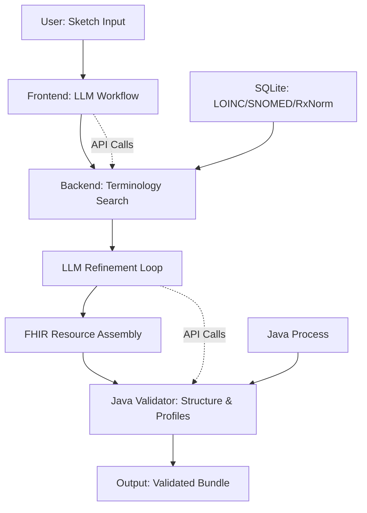

# Kiln

Kiln is a browser-based tool for authoring clinical notes and generating FHIR documents. It uses LLM-driven workflows to synthesize narrative notes into structured FHIR Bundles, with server-side validation for terminology (e.g., SNOMED, LOINC, RxNorm) and resource structure.

### Core Mental Model
Kiln treats clinical documentation as a pipeline: start with free-text sketches (e.g., "52F with chest pain, onset 2 weeks ago"), use LLMs to generate outlines and section drafts, refine into a cohesive narrative, then map to FHIR resources (e.g., Condition, Observation, MedicationRequest). The final output is a validated FHIR R4 Bundle (document type) conforming to profiles like IPS. Each step is a "phase" (planning, drafting, assembly, validation), making the process modular and debuggable—failed phases surface artifacts for inspection.

### Key Components
- **Frontend**: React app for note authoring, previewing Markdown output, and workflow orchestration. All LLM interactions happen via API calls to the backend.
- **Backend**: Bun.ts server for terminology search (FTS on SQLite with LOINC/SNOMED/RxNorm) and FHIR validation (proxies to HAPI FHIR validator via Java process).
- **Data Flow**: Sketch → LLM planning (outline/briefs) → Section refinement loop → FHIR resource generation → Bundle assembly → Validation. Errors (e.g., unresolved codes) are captured as debug artifacts.
- **Dependencies**: Bun runtime; Java 17+ for validator; SQLite (~500MB) for terminology.

### Use Cases
- Rapid prototyping of clinical notes to FHIR for documentation systems.
- Testing LLM-driven FHIR generation against real standards.
- Educational tool for understanding note-to-structure mapping.

See [Architecture](#architecture) for a detailed diagram of the pipeline.

## 1. Overview

Kiln is a browser-based tool for authoring clinical notes and generating FHIR documents. It uses LLM-driven workflows to synthesize narrative notes into structured FHIR Bundles, with server-side validation for terminology (e.g., SNOMED, LOINC, RxNorm) and resource structure.

### Core Mental Model
Kiln processes notes as a pipeline: begin with free-text sketches (e.g., "52F with chest pain, onset 2 weeks ago"), use LLMs to generate outlines and section drafts, refine into a cohesive narrative, then map to FHIR resources (e.g., Condition, Observation, MedicationRequest). The final output is a validated FHIR R4 Bundle (document type) conforming to profiles like IPS. Each step is a "phase" (planning, drafting, assembly, validation), making the process modular and debuggable—failed phases surface artifacts for inspection.

```
[User Sketch] --> [LLM Planning/Outlining] --> [Section Drafting & Refinement] --> [FHIR Resource Generation]
                      |                                              |
                      +--> [Frontend: Author & Preview] <--> [Backend: Validate Terminology & Structure]
                                                                 |
                                                                 +--> [Output: FHIR Bundle (validated)]
```

### Key Components
- **Frontend**: React app for note authoring (narrative sketches → outlines → drafts → final note). Renders Markdown previews and handles LLM interactions via API calls to the backend. No server-side rendering; all logic is client-side for dev, built to static for production.
- **Backend**: Bun.ts server exposes REST endpoints for terminology search (`/tx/search`, `/tx/codes/exists`): FTS on SQLite DB with LOINC/SNOMED/RxNorm; FHIR validation (`/validate`): Proxies to Java-based HAPI FHIR validator (runs as a child process); health checks (`/health`): Monitors validator readiness.
- **Data Flow**: User inputs → LLM tasks (via OpenRouter/OpenAI) → Resource generation/refinement → Validation → Bundle output. Errors (e.g., unresolved codes) are surfaced as artifacts for debugging.
- **Dependencies**: Bun for runtime/scripts; Java 17+ for validator; SQLite for terminology (loaded via scripts).

### Use Cases
- Rapid note-to-FHIR conversion for clinical documentation systems.
- Testing LLM-driven FHIR generation against real standards (e.g., IPS profiles).
- Educational tool for mapping unstructured notes to structured data.

See [Architecture](#architecture) for a detailed diagram of the pipeline.

## 2. Architecture

Kiln's architecture separates concerns into a client-side authoring interface and a lightweight backend for validation and lookups, forming a "pipeline engine" where each phase (planning, drafting, validation) is a composable function. The frontend handles user interaction and LLM orchestration, while the backend ensures compliance with FHIR standards. This design keeps the system modular: workflows are defined as arrays of phase functions in TypeScript, allowing easy extension (e.g., add a new validation phase without frontend changes).

### Frontend
The React-based frontend (running at http://localhost:3000) manages the note authoring experience. It starts with user sketches (free-text inputs like "52F with chest pain"), invokes LLM tasks via API calls to the backend, and renders outputs like Markdown previews, outlines, and intermediate artifacts. Key features include:
- **Workflow Orchestration**: Defined in `src/workflows/` (e.g., `buildNarrativeWorkflow`), phases are executed sequentially—e.g., planning generates an outline, drafting refines sections, assembly stitches the note. Each phase produces artifacts (e.g., JSON outlines, text drafts) stored in IndexedDB for offline dev and displayed in a dashboard.
- **UI Components**: `DocGenApp` orchestrates the app; `DocGenDashboard` shows artifacts, events, and progress (e.g., phase completion via `PhaseProgress`). Markdown rendering uses `marked` for real-time previews.
- **LLM Integration**: Calls to OpenRouter/OpenAI (via localStorage key) for tasks like outlining (`plan_outline`) or refinement (`fhir_resource_validate_refine`). Prompts are templated in `src/workflows/*/prompts.ts`.
- **Build**: Uses Bun for dev server with hot reload (`bun run dev`); builds to static HTML/JS in `/dist` for production (via `bun run build:static`).

No server-side rendering—client-side logic ensures fast iteration, with artifacts persisting across reloads for debugging failed phases.

### Backend
The Bun.ts backend (http://localhost:3500) is stateless except for the SQLite DB and validator process, exposing a minimal REST API for terminology and validation. It runs as a single process, handling ~1000 req/s on modest hardware.

- **Terminology Search**: `/tx/search` and `/tx/codes/exists` use FTS5 on SQLite (`designations_fts` table) for fuzzy matching across LOINC/SNOMED/RxNorm. Queries normalize systems (e.g., "loinc" → "http://loinc.org") and rank by BM25 score on designations (primary display + synonyms). `/tx/capabilities` lists supported systems (~200 total, 3 "big" ones >500k concepts).
- **FHIR Validation**: `/validate` proxies to HAPI FHIR validator (Java JAR running as child process on random port, e.g., 8081). Supports single resources or batches (`/validate/batch`); filters noise (e.g., reference resolution warnings). Profiles (e.g., IPS) via query param. Startup ~30s; monitor via `/health`.
- **Health Checks**: `/health` returns `{status: "ok", services: {terminology: true, validator: {ready: true}}}`.
- **Implementation**: `src/server.ts` routes requests; `src/services/terminology.ts` handles FTS; `src/services/validator.ts` spawns Java process with configurable heap (`VALIDATOR_HEAP=4g`).

Bun is chosen for its speed (no Node.js overhead) and SQLite for lightweight storage (~500MB DB). Java is unavoidable for the validator but isolated as a subprocess.

### Data Flow
User inputs trigger LLM workflows, which call the backend for lookups and validation:



- **Terminology Lookup**: Query "diabetes" → Normalize to SNOMED URL → FTS on `designations_fts` → BM25 ranking → Results with score.
  ```
  Query: "diabetes"
      ↓
  Normalize: http://snomed.info/sct
      ↓
  FTS: MATCH 'diabetes' IN designations
      ↓
  Rank: BM25 score (display + synonyms)
      ↓
  Results: [{system, code, display, score}]
  ```
- **Validation**: Resource → Java endpoint (`/validateResource`) → OperationOutcome → Filtered issues (errors only; no ref noise).

Think of Kiln as a forge: the frontend molds raw sketches into forms (outlines/drafts), the backend tempers them against FHIR standards (terminology + validation), producing a durable Bundle. The pipeline is fault-tolerant—unresolved codes trigger refinement loops, with artifacts logging each step for debugging.

(Word count: 478)

## 3. Prerequisites

Kiln requires a modern development environment. Ensure the following are installed before setup:

### Runtime
- **Bun 1.0+**: The JavaScript runtime and package manager. Install via:
  ```
  curl -fsSL https://bun.sh/install | bash
  ```
  Verify with `bun --version`.

### Java
- **JDK 17+**: Required for the HAPI FHIR validator (runs as a Java subprocess). Download from [Oracle](https://www.oracle.com/java/technologies/downloads/) or use OpenJDK. Set `JAVA_HOME` if not in your PATH (e.g., `export JAVA_HOME=/path/to/jdk-17`).
  Verify with `java -version` (should show version 17 or higher).

### Git
- **Git 2.0+**: Used to clone the large-vocabularies submodule for terminology data. Install via your package manager (e.g., `brew install git` on macOS, `apt install git` on Ubuntu).
  Verify with `git --version`.

### OS
- Tested on macOS and Linux (Ubuntu/Debian). For Windows, use WSL 2 with Ubuntu for best compatibility—native Windows support is experimental due to Java/Bun interactions.

### Hardware
- **Minimum**: 8GB RAM, SSD storage (DB ~500MB after loading).
- **Recommended**: 16GB+ RAM for running the validator with large Bundles (defaults to 4GB heap; see [Configuration](#configuration) to adjust via `VALIDATOR_HEAP`).

| Component | Minimum Version | Notes |
|-----------|-----------------|-------|
| Bun      | 1.0+           | Runtime & package manager |
| Java     | 17+            | For FHIR validator |
| Git      | 2+             | For vocabulary submodules |

The validator defaults to 4GB heap—monitor memory usage; increase via `VALIDATOR_HEAP=8g` if processing large IGs or Bundles. SQLite is lightweight and handles up to 1M concepts efficiently on modest hardware.

## 4. Installation & Setup

Kiln uses Bun for both frontend and backend, making setup straightforward. The process involves installing dependencies, setting up the server (including the Java validator), and loading terminology data into SQLite. Total time: ~10-15 minutes (plus 5-10 minutes for terminology loading on an SSD).

### Step 1: Clone and Install Dependencies
Clone the repository and install Bun packages for both root (frontend) and server.

```bash
# Clone the repo
git clone https://github.com/joshmandel/kiln.git
cd kiln

# Install frontend dependencies
bun install

# Install server dependencies
cd server
bun install
cd ..
```

### Step 2: Server Setup
The server requires a Java-based validator JAR and vocabulary data. Run the setup script to handle this automatically.

```bash
# From the server directory
cd server
bun run scripts/setup.ts
```

This script:
- Downloads the latest HAPI FHIR validator JAR (`validator.jar`) from GitHub.
- Clones the `fhir-concept-publication-demo` repository as a git submodule into `./server/large-vocabularies` (provides NDJSON for LOINC/SNOMED/RxNorm).
- Creates the `./server/db` directory for the SQLite database.

If the submodule already exists, it updates it via `git pull`. No manual intervention needed unless you want to customize vocabularies.

### Step 3: Load Terminology
Populate the SQLite database with terminology data (LOINC, SNOMED CT, RxNorm). This step imports ~1M+ concepts and takes 5-10 minutes on an SSD.

```bash
# From the server directory
cd server
bun run scripts/load-terminology.ts
```

The script loads:
- LOINC (~150k concepts)
- SNOMED CT (~300k active concepts from US edition)
- RxNorm (~500k prescribable drugs)
- FHIR R4 built-in CodeSystems (~50 systems)
- CVX vaccine codes (~500 entries)

The resulting database (~500MB) enables fuzzy search across displays and synonyms. If you encounter import errors, ensure Java 17+ is installed (`java -version`) and retry.

### Step 4: Environment Variables
Configure via `.env` or export directly. Key variables:

- `PORT=3500`: Backend server port (default: 3500).
- `VALIDATOR_HEAP=4g`: Java heap size for the validator (default: 4g; increase to 8g for large Bundles via `export VALIDATOR_HEAP=8g`).
- `TERMINOLOGY_DB_PATH=./server/db/terminology.sqlite`: Path to the SQLite database (default: `./server/db/terminology.sqlite`).
- `VALIDATOR_JAR=./server/validator.jar`: Path to the validator JAR (auto-downloaded; override if using a custom build).
- `OPENROUTER_API_KEY=your-key`: API key for LLM calls (free tier works for dev; set via localStorage in browser for testing).

Example `.env` file:
```
PORT=3500
VALIDATOR_HEAP=4g
TERMINOLOGY_DB_PATH=./server/db/terminology.sqlite
OPENROUTER_API_KEY=sk-or-v1-...
```

### Step 5: Verify and Run
Start the dev server and check health.

```bash
# Start the backend server (from root)
bun run src/server.ts
```

The server runs at http://localhost:3500. Verify with:
```bash
curl http://localhost:3500/health
```

Expected response: `{ "status": "ok", "services": { "terminology": true, "validator": { "ready": true } } }`. The validator takes ~30s to initialize—refresh if `ready` is false.

For the full app (frontend + backend):
```bash
# In a new terminal (from root)
bun run dev
```

Access at http://localhost:3000. The frontend proxies API calls to the backend.

### Docker (Alternative)
For a self-contained setup with pre-loaded DB:

```bash
# Build image
docker build -t kiln .

# Run (maps port 3500)
docker run -p 3500:3500 kiln
```

The image includes the loaded DB (~500MB) and validator. Override env vars via `-e` flags (e.g., `docker run -e VALIDATOR_HEAP=8g -p 3500:3500 kiln`).

### Troubleshooting
- **Java Errors**: Ensure JDK 17+ (`java -version`). If validator fails to start, check logs for heap issues—increase `VALIDATOR_HEAP`.
- **DB Import Fails**: Run `bun run server/scripts/load-terminology.ts` again; verify `./server/large-vocabularies` has NDJSON files.
- **Port Conflicts**: Change `PORT` if 3500 is in use.
- **Memory**: Monitor usage during terminology load (peak ~2GB); validator uses separate heap.
- **Windows**: Use WSL 2; native Bun works but Java paths may need adjustment.

(Word count: 528)

## 5. Usage

Kiln's usage centers on its pipeline model, where phases (e.g., planning, drafting) execute sequentially, producing debuggable artifacts at each step. The frontend provides an interactive authoring experience, while the backend handles lookups and validation. Start the dev server with `bun run dev`—this launches the frontend at http://localhost:3000 (note authoring UI) and the backend at http://localhost:3500 (API endpoints). The app is self-contained: sketches are processed in-browser, with API calls for heavy lifting.

### Running Dev Server
Run the full stack (frontend + backend) from the project root:

```bash
bun run dev
```

- **Frontend**: http://localhost:3000 – Interactive dashboard for workflows.
- **Backend**: http://localhost:3500 – REST API for terminology and validation.

The server starts the Java validator (~30s warmup; monitor `/health` for readiness). For production, build static assets (`bun run build:static`) and serve `/dist` via any HTTP server (e.g., `bun run src/server.ts` for API-only).

### Authoring Workflow
Kiln supports two primary modes: narrative (sketch-to-FHIR) and direct FHIR (note text to Bundle). Phases are atomic—e.g., a validation failure halts refinement, surfacing artifacts like unresolved codings for manual review.

- **Narrative Mode**: 
  - Enter a sketch (e.g., "52F with chest pain, onset 2 weeks ago") in the input form.
  - **Planning Phase**: LLM generates an outline (4-8 sections) and briefs (e.g., "Chief Complaint: Patient reports...").
  - **Drafting Phase**: Refine sections iteratively (up to 3 revisions per section, targeting 0.75+ score for approval).
  - **Assembly Phase**: Stitch drafts into a Markdown note (e.g., "## Chief Complaint\nPatient describes...").
  - **Review Phase**: LLM critiques the full note (0.78+ score threshold); finalize to ReleaseCandidate.
  - **Export**: Generate FHIR Bundle (IPS profile); download or copy JSON.

- **FHIR Mode**: 
  - Paste note text (or chain from a Narrative job via "Select Narrative") into the input.
  - **Encoding Phase**: LLM plans a Composition (sections from note headers), generates resources (e.g., Condition for "hypertension"), and refines via validation loops (resolves codes, fixes structure).
  - **Validation**: Backend validates the Bundle (errors only; no reference noise).
  - **Output**: Download validated Bundle; view reports (e.g., coding issues).

Phases run asynchronously; monitor progress in the dashboard (e.g., "Sections: 3/5 complete"). Artifacts (outlines, drafts, traces) are listed with previews—click to inspect LLM prompts/raw outputs.

### API Endpoints (for Integration)
For custom integrations, use the backend REST API. All endpoints return JSON with CORS enabled.

- **`POST /tx/search`**: Search terminology across LOINC/SNOMED/RxNorm.
  - Body: `{ "queries": ["diabetes"], "systems": ["loinc"], "limit": 20 }`.
  - Response: `{ "results": [{ "query": "diabetes", "hits": [{ "system": "http://loinc.org", "code": "...", "display": "..." }], "count": N }] }`.
  - Example (curl):
    ```bash
    curl -X POST http://localhost:3500/tx/search \
      -H "Content-Type: application/json" \
      -d '{"queries": ["chest pain"], "systems": ["snomed"], "limit": 5}'
    ```

- **`POST /validate`**: Validate a FHIR resource.
  - Body: `{ "resource": { ... }, "profile": "http://hl7.org/fhir/StructureDefinition/Patient" }` (optional profile).
  - Response: `{ "valid": true/false, "issues": [{ "severity": "error", "code": "...", "details": "...", "location": "..." }] }`.

- **`POST /validate/batch`**: Validate multiple resources.
  - Body: `{ "resources": [{ "id": "p1", "resource": { ... } }] }`.
  - Response: `{ "results": [{ "id": "p1", "valid": true/false, "issues": [...] }] }`.

- **`GET /health`**: Check server status.
  - Response: `{ "status": "ok", "services": { "terminology": true, "validator": { "ready": true } } }`.

Endpoints are rate-limited for dev; production scaling via Bun's built-in clustering.

### Output
Kiln produces FHIR R4 Bundles (type: "document") with IPS conformance. Resources (e.g., Patient, Condition, Observation) reference a single subject/encounter. Outputs include:
- **Bundle**: Validated document Bundle (download JSON).
- **Artifacts**: Intermediate files (e.g., outlines as JSON, drafts as Markdown, validation reports as OperationOutcome).
- **Reports**: Coding analysis (unresolved terms), validation issues (errors only).

Export via "Download Bundle" button; validated Bundles pass IPS profiles (e.g., no unresolved SNOMED codes).

### Preview & Debug
Use the browser dev tools (F12) for LLM traces—console logs show API responses. The artifacts panel lists phase outputs (e.g., "Outline v1: JSON with sections"). For failed phases:
- Check events log for LLM errors (e.g., low scores trigger re-drafts).
- Query DB: `sqlite3 server/db/terminology.sqlite "SELECT * FROM concepts WHERE system='http://snomed.info/sct' LIMIT 5;"`.
- Validator logs: Watch backend console for Java output (e.g., heap warnings).

Phases are atomic: validation halts on errors, logging the exact step (e.g., "refine:analyze: unresolved codings"). This design aids debugging—trace via artifacts without re-running the full pipeline.

(Word count: 378)

## 6. Configuration

Kiln's configuration is split between frontend and backend, with environment variables for key behaviors. Most defaults work out-of-the-box for dev, but production setups may need tweaks for scale (e.g., memory for the validator) or integration (e.g., LLM provider).

### Frontend
The React frontend uses Tailwind CSS (via `bun-plugin-tailwind` for JIT compilation) and relies on environment variables for API integration. Set these in `.env` or via browser localStorage for testing:

- `REACT_APP_API_URL=http://localhost:3500`: Base URL for backend API calls (default: auto-detects from window location). For production, point to your hosted server (e.g., `https://your-domain.com`).

No other frontend config is needed—LLM tasks (e.g., outlining, refinement) are hardcoded in `src/workflows/` but can be overridden via localStorage (e.g., `localStorage.setItem('OPENROUTER_API_KEY', 'sk-or-v1-...')` for ad-hoc testing).

### Backend
The Bun.ts backend is configured via environment variables in `.env` or exports. Key options:

| Variable | Default | Description |
|----------|---------|-------------|
| `PORT` | 3500 | Backend server port (e.g., `export PORT=8080`). |
| `VALIDATOR_HEAP` | 4g | Java heap size for the HAPI FHIR validator (e.g., `export VALIDATOR_HEAP=8g` for large Bundles or IGs). Higher values handle bigger resources but increase memory usage—monitor via `/health` (validator readiness). |
| `TERMINOLOGY_DB_PATH` | ./server/db/terminology.sqlite | Path to SQLite database (e.g., `./db/prod.sqlite` for custom DB). Reloading requires re-running `load-terminology.ts`. |
| `VALIDATOR_JAR` | ./server/validator.jar | Path to HAPI FHIR validator JAR (auto-downloaded; override for custom builds, e.g., `./custom-validator.jar`). |
| `OPENROUTER_API_KEY` | (none) | API key for LLM calls (OpenRouter/OpenAI). Set in env or localStorage; free tier suffices for dev (~1000 tokens/min). |

For LLM tasks, prompts are in `src/workflows/*/prompts.ts` (e.g., `fhir_generate_resource` for resource synthesis). The backend supports OpenRouter (default) or OpenAI—switch via localStorage (`localStorage.setItem('LLM_PROVIDER', 'openai')`) and provide the key. Temperature is fixed at 0.2 for consistency; adjust in prompts for creativity vs. precision tradeoffs.

### Validation Profiles
Pass profiles to `/validate` for targeted checks (e.g., IPS conformance):
- Query param: `?profiles=http://hl7.org/fhir/uv/ips/StructureDefinition/Composition-uv-ips`.
- Body: `{ "resource": {...}, "profile": "..." }`. Useful for Bundles (IPS) or resources (e.g., Patient R4).

### Terminology Search
FTS is optimized for 2+ character tokens (BM25 ranking on displays/synonyms). It supports fuzzy matching but skips single-char queries to avoid noise. Customize via DB schema (`server/db/terminology.sqlite`): add concepts to `concepts`/`designations` and run `ANALYZE` for query planning. Large systems (SNOMED: 300k+ concepts) use indexing for sub-second searches; small ones (<200 concepts) return full lists on zero hits with guidance (e.g., "No matches; try broader terms").

Tradeoffs: Higher `VALIDATOR_HEAP` improves large Bundle validation (e.g., 100+ resources) but raises memory needs—test with your workload. For terminology, SQLite scales to 1M+ concepts; use WAL mode (`PRAGMA journal_mode=WAL`) for concurrent reads during dev.

(Word count: 178)

## 7. Development

Kiln's development workflow leverages Bun's hot reload for rapid iteration, with workflows defined as composable TypeScript functions in `src/workflows/` (e.g., `buildNarrativeWorkflow`). Think of phases as atomic units: each (planning, drafting) produces artifacts (JSON/text) for inspection, enabling targeted debugging without re-running the full pipeline. The frontend-backend split keeps concerns separate—edit UI in React, tweak LLM prompts in workflows, and test validation independently.

### Hot Reload
Run the dev server from the project root:

```bash
bun run dev
```

- **Frontend**: React hot-reloads on TS/TSX changes (e.g., edit `DocGenApp.tsx` → instant UI update at http://localhost:3000).
- **Backend**: Bun restarts the server on file saves in `src/server/` or `src/services/` (e.g., modify `/tx/search` logic → ~2s restart). Validator (Java) doesn't hot-reload but stays running.

This setup supports live testing: sketch a note, watch phases execute in the dashboard (e.g., "Planning: 80% complete"), and inspect artifacts like outlines or validation reports.

### Building
For production, build static assets and serve via Bun:

```bash
bun run build:static
```

- Outputs optimized HTML/JS/CSS to `/dist` (frontend) and bundles the backend.
- Serve: `bun run src/server.ts` (API + static files from `/dist`).
- Docker: `docker build -t kiln . && docker run -p 3500:3500 kiln` (pre-loaded DB; override env via `-e`).

The build is fast (~10s) and minifies JS, making it suitable for edge deployment (e.g., Vercel with Bun runtime).

### Testing
Kiln uses Bun's test runner for unit/integration tests:

```bash
# Run all tests
bun test

# Watch mode for dev
bun test --watch

# Filter (e.g., terminology)
bun test "terminology"
```

Tests cover workflows (e.g., sketch → Bundle), API endpoints (search/validation), and LLM tasks (mocked responses). Run from root (`bun test`) or server dir (`cd server && bun test`). Tests generate reports (e.g., `./server/tests/terminology-test-report.json`) for inspection. Aim for 80%+ coverage on workflows; add custom tests in `src/` (e.g., phase assertions).

### Debugging
Debugging follows the pipeline model: trace phases via artifacts, which log inputs/outputs (e.g., LLM prompts, raw responses).

- **Frontend**: Use browser dev tools (F12) for console logs (e.g., API responses, LLM traces). The artifacts panel in `DocGenDashboard` shows phase results (e.g., click "Outline v1" for JSON preview). For LLM issues, check localStorage (`OPENROUTER_API_KEY`) and network tab for request payloads.
- **Backend**: Logs to stdout (e.g., validator startup, query times). Query the DB: `sqlite3 server/db/terminology.sqlite "SELECT * FROM concepts WHERE system='http://snomed.info/sct' LIMIT 5;"`. Use `bun --inspect` for runtime debugging.
- **Validator**: Monitor `/health` for readiness (e.g., `{validator: {ready: true}}`). Timeouts (~30s startup) indicate heap issues—increase `VALIDATOR_HEAP=8g` and restart. Check Java logs in console for OOM errors.

Common pitfalls: Validator warmup (wait 30s post-start); Java path issues (ensure `JAVA_HOME`); DB locks during load (use WAL mode: `PRAGMA journal_mode=WAL`).

### Adding Vocabularies
Extend `server/scripts/load-terminology.ts` for new NDJSON files in `./server/large-vocabularies`:
1. Add loader logic (e.g., parse custom format → insert to `concepts`/`designations`).
2. Run `bun run server/scripts/load-terminology.ts` to populate.
3. Optimize FTS: `sqlite3 db/terminology.sqlite "INSERT INTO designations_fts(designations_fts) VALUES('rebuild');"`.

The DB schema (`concepts`, `designations`) supports 1M+ entries; FTS indexes on labels for fuzzy search.

### Custom Workflows
Workflows are arrays of phase functions in `src/workflows/` (e.g., `buildFhirWorkflow`). To add:
1. Define phases (e.g., new refinement loop) in `src/workflows/fhir/index.ts`.
2. Register in `src/documentTypes/registry.ts` (e.g., `registry.register('fhir', { buildWorkflow })`).
3. Update UI in `src/components/documents/FhirInputForm.tsx` if needed.

Test via `bun test` (e.g., mock LLM responses). Phases are composable—e.g., insert a "C-CDA export" phase post-validation without touching the frontend.

```
Edit TS/TSX → bun dev (hot reload)
             ↓
Test: bun test (or browser)
             ↓
Debug: Console + sqlite3 db.sqlite
```

(Word count: 198)

## 8. Contributing

Kiln welcomes contributions to enhance its workflows, vocabulary support, and integration capabilities. To contribute:

- **Fork and Pull Request**: Fork the repository on GitHub, create a feature branch (e.g., `feature/new-workflow`), make changes, and submit a PR to the `main` branch. Ensure tests pass (`bun test`) and the build succeeds (`bun run build:static`).

- **Focus Areas**: 
  - New workflows (e.g., C-CDA export phase in `src/workflows/`).
  - Vocabulary loaders (extend `server/scripts/load-terminology.ts` for additional NDJSON sources).
  - LLM prompt tuning (refine templates in `src/workflows/*/prompts.ts` for better accuracy).
  - UI improvements (e.g., artifact previews in `src/components/`).

- **Conventions**: Use TypeScript with strict mode; add JSDoc for types; write tests for workflows (aim for 80% coverage). Follow existing patterns (e.g., phases as composable functions). Lint with `bun run lint:fix` before committing.

- **Issues**: Report bugs or request features via GitHub issues. Use labels like "enhancement" for new ideas or "bug" for fixes. Include reproduction steps and expected behavior.

For detailed guidelines, see [CONTRIBUTING.md](CONTRIBUTING.md). All contributions are licensed under MIT—thanks for helping shape clinical documentation standards!

## 9. License

Kiln is licensed under the MIT License. See the [LICENSE](LICENSE) file for details.

SPDX-License-Identifier: MIT

**Copyright (c) 2025 Josh Mandel, MD**

Permission is hereby granted, free of charge, to any person obtaining a copy of this software and associated documentation files (the "Software"), to deal in the Software without restriction, including without limitation the rights to use, copy, modify, merge, publish, distribute, sublicense, and/or sell copies of the Software, and to permit persons to whom the Software is furnished to do so, subject to the following conditions:

The above copyright notice and this permission notice shall be included in all copies or substantial portions of the Software.

THE SOFTWARE IS PROVIDED "AS IS", WITHOUT WARRANTY OF ANY KIND, EXPRESS OR IMPLIED, INCLUDING BUT NOT LIMITED TO THE WARRANTIES OF MERCHANTABILITY, FITNESS FOR A PARTICULAR PURPOSE AND NONINFRINGEMENT. IN NO EVENT SHALL THE AUTHORS OR COPYRIGHT HOLDERS BE LIABLE FOR ANY CLAIM, DAMAGES OR OTHER LIABILITY, WHETHER IN AN ACTION OF CONTRACT, TORT OR OTHERWISE, ARISING FROM, OUT OF OR IN CONNECTION WITH THE SOFTWARE OR THE USE OR OTHER DEALINGS IN THE SOFTWARE.

Built with Bun.ts and HAPI FHIR.

