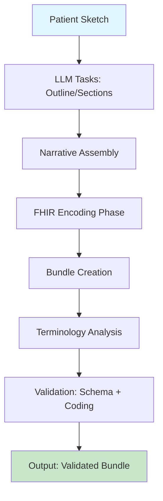
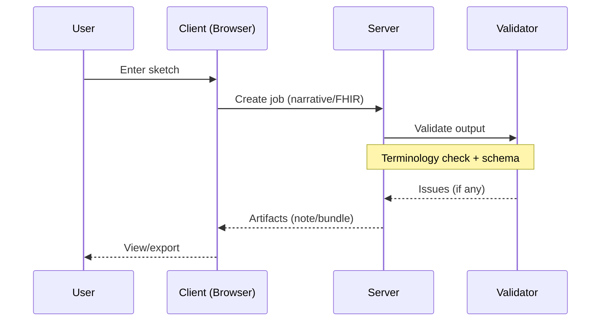

# Kiln

Kiln is a development tool for generating clinical narratives from simple patient sketches and converting them into validated FHIR bundles. It uses structured LLM prompts to synthesize notes, analyzes terminology for accuracy (drawing from LOINC, SNOMED CT, and RxNorm), and validates outputs against FHIR R4 schemas. The system runs as a single Bun server, combining a browser-based UI for authoring with API endpoints for terminology search and validation. It supports two workflow types: "narrative" for note creation and "fhir" for bundle generation from existing notes. Outputs include artifacts like outlines, drafts, and final bundles, with unresolved codings flagged via FHIR extensions for manual review.

## 1. Overview

Kiln provides a lightweight environment for prototyping clinical documentation. From a browser interface, users input a patient sketch (e.g., "52F with chest pain, onset 2 weeks ago") to generate a structured narrative note via a series of LLM tasks: planning an outline, drafting sections, assembling, and finalizing. It can also convert notes (generated or pasted) into FHIR Document bundles, ensuring compliance with IPS profiles for resources like Condition, Observation, and MedicationRequest. Terminology is validated during generation, with searches against pre-loaded LOINC, SNOMED CT, and RxNorm databases in SQLite. The server uses the HAPI FHIR validator for schema checks and handles batch operations.

Core components include:
- **Client**: React app (`/src/app.tsx`) for job creation, artifact viewing, and export.
- **Server**: Bun API (`/server/src/server.ts`) with SQLite for terminology (`/server/src/services/terminology.ts`) and Java-based FHIR validation (`/server/src/services/validator.ts`).
- **Workflows**: Modular pipelines in `/src/workflows/` (e.g., narrative: sketch → outline → sections; FHIR: note → composition → resources → bundle).
- **Vocabularies**: Pre-loaded code systems in `/large-vocabularies/` (git submodule); supports custom NDJSON.gz additions.

Use cases include testing note-to-FHIR pipelines, validating terminology in prototypes, and exploring LLM-driven clinical synthesis. It is not intended for production EHR use or real patient data.

```
Patient Sketch → Narrative Generation → FHIR Bundle → Validation (Server)
(Browser)      → (Local/LLM)         → (Structured Output) → (Terminology + Schema Check)
```

For architecture details, see [Architecture](#2-architecture).

## 2. Architecture

Kiln follows a client-server model with a focus on modularity and stateless workflows. The client (React/Bun) handles UI interactions, job orchestration, and local state, while the server manages heavy operations like LLM calls, terminology searches, and FHIR validation. Jobs are self-contained units (e.g., a "narrative" job processes a sketch through phases: planning, sections, assembly). Artifacts (e.g., outlines, bundles) are stored in SQLite and viewable in the UI.

Data flow:
- **Input**: User enters sketch or note text in browser.
- **Workflow Execution**: Client creates a job via API (`POST /jobs`); server runs phases (e.g., `/src/workflows/narrative/index.ts` for notes, `/src/workflows/fhir/index.ts` for bundles).
- **Terminology**: During generation, the server searches SQLite (`/server/src/services/terminology.ts`) for codes; unresolved ones trigger refinement loops.
- **Validation**: Post-generation, the server validates via HAPI FHIR (`/server/src/services/validator.ts`), flagging issues like invalid codings as extensions (e.g., `http://kraken.fhir.me/StructureDefinition/coding-issue`).
- **Output**: Artifacts returned to client for viewing/export (JSON/XML).

Key files:
- `/src/app.tsx`: Main UI with job dashboard.
- `/src/engine.ts`: Runs workflows as phases (e.g., `step` function for LLM tasks).
- `/server/src/server.ts`: Bun API routes.
- `/server/src/services/terminology.ts`: SQLite FTS5 for code search.
- `/large-vocabularies/`: NDJSON.gz files (e.g., RxNorm); loaded via `/server/scripts/load-terminology.ts`.

Deployment: Run `bun run dev` for local (UI at :3000, API at :3500). For production, build static assets (`bun run build:static`) and deploy the Bun server.



## 3. Prerequisites

- **Bun**: Version 1.0+ (install: `curl -fsSL https://bun.sh/install | bash`).
- **Java**: 11 or later (for HAPI FHIR validator; checked during setup).
- **Git**: Required for the `large-vocabularies` submodule.
- **Hardware**: 8GB+ RAM (validator heap defaults to 4g; SSD recommended for SQLite).
- **Optional**: External FHIR server (e.g., HAPI) for advanced profiles; LLM API key (OpenRouter/HuggingFace) for generation.

Troubleshooting:
- Java heap errors: Set `export VALIDATOR_HEAP=8g`.
- Missing Java: Install via package manager (e.g., `apt install openjdk-17-jre`).
- Port conflicts: Change `PORT=3501` (server) or `PORT=3001` (client).

## 4. Installation

1. **Clone the repository**:
   ```
   git clone https://github.com/jmandel/kiln.git
   cd kiln
   ```

2. **Install dependencies**:
   ```
   bun install
   ```

3. **Run setup** (downloads validator JAR and clones vocabularies):
   ```
   bun run setup
   ```
   This fetches the latest HAPI validator (~100MB) and sets up the `large-vocabularies` submodule.

4. **Load terminology** (imports LOINC, SNOMED CT, RxNorm; ~5-10 min first time):
   ```
   bun run load-terminology
   ```
   Outputs `terminology.sqlite` in `./db/`. Re-run after submodule updates.

5. **Start the dev server**:
   ```
   bun run dev
   ```
   - UI: http://localhost:3000
   - API: http://localhost:3500 (e.g., `curl -X POST http://localhost:3500/tx/search -d '{"queries":["diabetes"]}'`).

For production:
- Build static assets: `bun run build:static` (outputs to `./dist/`).
- Deploy Bun server (e.g., via PM2: `pm2 start ecosystem.config.js`).
- Set env vars: `TERMINOLOGY_DB_PATH=./db/terminology.sqlite` (SQLite); `VALIDATOR_HEAP=8g` (if needed).

Initial load time: 10-15 minutes (vocabulary import). Subsequent runs are near-instant.

```
kiln/
├── src/          # Client code (React/Bun)
│   ├── app.tsx   # Main app
│   └── workflows/ # Job pipelines (narrative, FHIR)
├── server/       # API + services
│   ├── src/      # Bun server, SQLite handlers
│   └── db/       # SQLite DB (terminology.sqlite)
├── large-vocabularies/ # Code systems (git submodule)
└── validator.jar # FHIR validator (downloaded)
```

## 5. Usage

Kiln's browser UI provides a dashboard for creating and managing jobs. Each job runs a workflow (narrative or FHIR) and produces artifacts like outlines, notes, or bundles. Jobs are isolated, allowing parallel runs (e.g., generate note, then convert to FHIR).

### Browser App
- Open http://localhost:3000.
- Select workflow: "Narrative" (from sketch) or "FHIR" (from note text or existing narrative).
- For narrative: Enter sketch (e.g., "52F with chest pain, onset 2 weeks ago"); click "Start". View phases (planning → sections → assembly) in real-time.
- For FHIR: Paste note text or select a completed narrative job; click "Create". Outputs include Composition plan, resources, and bundle.
- Dashboard: Jobs list (sidebar); artifacts table (e.g., view/export JSON); events panel for logs.
- Export: Download artifacts as JSON/XML; open in FHIR viewers like [Simplifier.net](https://simplifier.net/analyze).

### API Endpoints
All endpoints under `/` (default: http://localhost:3500). Use JSON payloads.

- **Terminology Search** (`POST /tx/search`):
  ```
  curl -X POST http://localhost:3500/tx/search \
    -H "Content-Type: application/json" \
    -d '{"queries": ["diabetes"], "systems": ["http://loinc.org"], "limit": 10}'
  ```
  Response: `{ "results": [{ "query": "diabetes", "hits": [...], "count": N }] }`.

- **Code Existence Check** (`POST /tx/codes/exists`):
  ```
  curl -X POST http://localhost:3500/tx/codes/exists \
    -H "Content-Type: application/json" \
    -d '{"items": [{"system": "http://loinc.org", "code": "2345-7"}]}'
  ```
  Response: `{ "results": [{ "system": "...", "code": "2345-7", "exists": true, "display": "Glucose [Moles/volume] in Blood" }] }`.

- **Capabilities** (`GET /tx/capabilities`):
  ```
  curl http://localhost:3500/tx/capabilities
  ```
  Response: `{ "supportedSystems": ["http://loinc.org", "http://snomed.info/sct", ...], "bigSystems": [...], "builtinFhirCodeSystems": [...] }`.

- **FHIR Validation** (`POST /validate`):
  ```
  curl -X POST http://localhost:3500/validate \
    -H "Content-Type: application/json" \
    -d '{"resource": {"resourceType": "Patient", "name": [{"text": "John Doe"}]}}'
  ```
  Response: `{ "valid": true, "issues": [] }` (or issues array on failure).

- **Batch Validation** (`POST /validate/batch`):
  ```
  curl -X POST http://localhost:3500/validate/batch \
    -H "Content-Type: application/json" \
    -d '{"resources": [{"id": "p1", "resource": {"resourceType": "Patient", ...}}, ...]}'
  ```
  Response: `{ "results": [{ "id": "p1", "valid": true, "issues": [] }, ...] }`.

- **Health Check** (`GET /health`):
  ```
  curl http://localhost:3500/health
  ```
  Response: `{ "status": "ok", "services": { "terminology": true, "validator": { "ready": true } } }`.

Mental model: Jobs are like isolated builds (e.g., "narrative" job → note artifact → "fhir" job → bundle). API calls are stateless; use job IDs for tracking.



## 6. Workflows

Workflows are defined as phased functions in `/src/workflows/`, executed via the engine (`/src/engine.ts`). Each phase (e.g., "planning", "fhir") tags steps and artifacts for tracking. Jobs use a context object (`Context`) to manage state, artifacts, and LLM tasks.

### Narrative Workflow
Processes a sketch into a clinical note:
1. **Planning** (`/src/workflows/narrative/index.ts`): LLM generates outline (`plan_outline` prompt in `/src/prompts.ts`); creates briefs for sections.
2. **Sections**: For each outline section, loop: draft → critique → decide (up to 3 revisions; target score 0.75).
3. **Assembly**: Stitch approved sections into a note draft.
4. **Review**: Critique full note (target score 0.78); finalize if approved.

Key files:
- `/src/workflows/narrative/index.ts`: Defines phases (e.g., `revisionLoop` for scoring).
- `/src/prompts.ts`: Templates like `draft_section` (uses `<sketch>`, `<brief>`, `<priorSections>`).
- Mental model: Iterative refinement ensures quality; low scores trigger rewrites.

### FHIR Workflow
Converts note text to a bundle:
1. **Encoding** (`/src/workflows/fhir/index.ts`): LLM plans Composition (`fhir_composition_plan` prompt); generates resources (e.g., Condition from "Assessment").
2. **Terminology Analysis** (`/src/codingAnalysis.ts`): Searches for codes; unresolved trigger refinement (`fhir_resource_validate_refine` prompt).
3. **Validation** (`/src/validator.ts`): Schema check + coding existence; extensions for issues (e.g., `coding-issue` for unresolved SNOMED).

Key files:
- `/src/workflows/fhir/index.ts`: `generateAndRefineResources` (LLM + IPS profiles from `/ips-notes.ts`).
- `/src/services/fhirGeneration.ts`: Refinement loop (search → patch → re-validate).
- `/src/prompts.ts`: `fhir_generate_resource` (e.g., "Target Type: Observation/obs-ldl-1, Description: LDL-C value").

Mental model: FHIR generation is a loop—generate, analyze codings, refine unresolved (budget: 12 iters). Validation uses HAPI for R4; terminology from SQLite (FTS5 for fuzzy search).

```mermaid
graph LR
    A[Note Text] --> B[Extract Sections]
    B --> C[Generate Composition Plan]
    C --> D[Generate Resources<br/>(LLM + IPS Profiles)]
    D --> E[Terminology Search<br/>(LOINC/SNOMED/RxNorm)]
    E --> F[Analyze Codings]
    F -->|Unresolved?| G[Refine Loop: Search + Patch]
    G --> F
    F --> H[Finalize Bundle]
    H --> I[Validate: Schema + Coding]
    I -->|Valid| J[Output]
    I -->|Invalid| K[Issue Extensions]
```

## 7. Configuration

Configuration uses environment variables (server) and localStorage (browser). Changes require restart/reload.

| Variable | Purpose | Default |
|----------|---------|---------|
| `PORT` | Server port (UI + API) | 3500 |
| `TERMINOLOGY_DB_PATH` | SQLite path for codes | `./db/terminology.sqlite` |
| `VALIDATOR_HEAP` | Java heap for validator | `4g` |
| `VALIDATOR_JAR` | Path to validator.jar | `./validator.jar` |
| `FHIR_BASE_URL` | Base for bundle fullUrls | `https://kiln.fhir.me` |
| `TASK_DEFAULT_BASE_URL` | LLM API base (browser) | `https://openrouter.ai/api/v1` |
| `TASK_DEFAULT_API_KEY` | LLM API key | (empty) |
| `TASK_DEFAULT_MODEL` | Default LLM model | `openai/gpt-oss-120b:nitro` |

- **Custom Vocabulary**: Add NDJSON.gz to `/large-vocabularies/` (e.g., custom CodeSystem); run `bun run load-terminology`.
- **LLM Tasks**: Edit `/src/prompts.ts` for custom prompts; see `/src/llmTask.ts` for integration.
- **Server as Proxy**: Set `VALIDATION_SERVICES_URL` (browser) to external server for distributed setup.

Mental model: Server is a cache + validator proxy; client pulls from it. For production, scale with multiple workers (Bun supports this natively).

## 8. Development

- **Local Setup**: `bun install`; `bun run setup`; `bun run load-terminology`; `bun run dev`.
- **Testing**: `bun test` (unit/integration for workflows, validator); reports in `./tests/*-report.json`.
- **Building**: `bun run build:static` (outputs `./dist/` for static hosting).
- **Contributing**: Fork; add workflows (`/src/workflows/`); PRs focused on modularity (e.g., new job types via registry in `/src/documentTypes/registry.ts`).
- **Debugging**: Console logs; inspect DB with `bunx sqlite3 db/terminology.sqlite` (e.g., `SELECT * FROM concepts WHERE system='http://loinc.org' LIMIT 10;`). For LLM, check step artifacts in UI.

## 9. License

MIT License. See [LICENSE](LICENSE) for details.

This project incorporates:
- LOINC® (http://loinc.org): Copyright © 1995-2024 Regenstrief Institute, Inc.
- SNOMED CT®: International Health Terminology Standards Development Organisation.
- RxNorm: U.S. National Library of Medicine.
- FHIR validator: HAPI FHIR (Apache 2.0).

## 1. Overview

Kiln is a development tool for generating clinical narratives from simple patient sketches and converting them into validated FHIR bundles. It uses structured LLM prompts to synthesize notes, analyzes terminology for accuracy (drawing from LOINC, SNOMED CT, and RxNorm), and validates outputs against FHIR R4 schemas. The system runs as a single Bun server, combining a browser-based UI for authoring with API endpoints for terminology search and validation. It supports two workflow types: "narrative" for note creation and "fhir" for bundle generation from existing notes. Outputs include artifacts like outlines, drafts, and final bundles, with unresolved codings flagged via FHIR extensions for manual review.

Core components include:
- **Client**: React app (`/src/app.tsx`) for job creation, artifact viewing, and export.
- **Server**: Bun API (`/server/src/server.ts`) with SQLite for terminology (`/server/src/services/terminology.ts`) and Java-based FHIR validation (`/server/src/services/validator.ts`).
- **Workflows**: Modular pipelines in `/src/workflows/` (e.g., narrative: sketch → outline → sections; FHIR: note → composition → resources → bundle).
- **Vocabularies**: Pre-loaded code systems in `/large-vocabularies/` (git submodule); supports custom NDJSON.gz additions.

Use cases include testing note-to-FHIR pipelines, validating terminology in prototypes, and exploring LLM-driven clinical synthesis. It is not intended for production EHR use or real patient data.

```
Patient Sketch → Narrative Generation → FHIR Bundle → Validation (Server)
(Browser)      → (Local/LLM)         → (Structured Output) → (Terminology + Schema Check)
```

For architecture details, see [Architecture](#2-architecture).

## 2. Architecture

Kiln's architecture emphasizes modularity, with a clear separation between the client-side UI for user interaction and the server-side services for computation-intensive tasks. The system is designed for stateless operation, where jobs (e.g., narrative generation or FHIR conversion) are self-contained workflows that produce traceable artifacts. This allows for easy extension, such as adding new job types or integrating external services. The entire stack runs on Bun (a fast JavaScript runtime), leveraging its built-in SQLite for lightweight storage and Java for the FHIR validator.

### High-Level Components

- **Client (Browser UI)**: Built with React and TypeScript (`/src/app.tsx`), the client handles user input, job orchestration, and artifact visualization. It uses a job-centric model: users create "narrative" jobs from sketches or "fhir" jobs from note text, then monitor progress via a dashboard. The UI is stateless—jobs are submitted to the server via API calls, and results (artifacts like outlines or bundles) are fetched and displayed. Key features include a sidebar for job management, an artifacts table for viewing outputs, and an events panel for real-time logs. No local persistence; all state is server-side.

- **Server (Bun API)**: The core server (`/server/src/server.ts`) exposes RESTful endpoints for job creation, terminology search, and validation. It uses Bun's native SQLite integration for the terminology database (`/server/src/services/terminology.ts`), which stores pre-loaded code systems like LOINC, SNOMED CT, and RxNorm. For FHIR validation, it spawns a Java process using the HAPI FHIR validator JAR (`/server/src/services/validator.ts`). The server is single-threaded by default but can be scaled horizontally with Bun's worker support.

- **Workflow Engine**: Located in `/src/engine.ts`, this orchestrates job phases (e.g., planning, encoding, validation). Each phase is a function that runs LLM tasks (via `/src/llmTask.ts`) and server calls. Jobs are identified by ID (e.g., `job:<hash>`), and artifacts are stored in SQLite with metadata (e.g., tags for phase, version). The engine ensures isolation: a narrative job produces note artifacts, which can feed into an FHIR job without shared state.

- **Vocabulary Storage**: Code systems are loaded into SQLite (`/large-vocabularies/`) as NDJSON.gz files (e.g., RxNorm's 1M+ concepts). The loader (`/server/scripts/load-terminology.ts`) imports them into tables like `concepts` and `designations` for efficient FTS5 full-text search. This keeps the browser lightweight while enabling fast terminology lookups.

- **External Dependencies**: LLM integration uses OpenRouter or similar (configurable via localStorage); the validator requires Java 11+. No external database needed—SQLite handles everything.

### Data Flow

Sketches and notes flow through modular workflows, with the server handling compute-heavy steps. For a narrative job:
1. Client submits sketch to `/jobs` endpoint.
2. Server runs phases in `/src/workflows/narrative/index.ts`: LLM generates outline (`plan_outline` prompt), then iterates section drafts/critiques.
3. Artifacts (e.g., JSON outlines, text notes) are stored and returned to client for display.
4. For FHIR conversion: Note text → LLM plans Composition (`fhir_composition_plan` in `/src/prompts.ts`) → generates resources → terminology analysis (`/src/codingAnalysis.ts`) → refinement loop if unresolved codes found → bundle creation → validation.

Validation integrates at multiple points: post-generation, the server calls the HAPI validator for R4 schema compliance and checks codings against the terminology DB. Unresolved issues (e.g., invalid SNOMED codes) are attached as FHIR extensions (e.g., `http://kraken.fhir.me/StructureDefinition/coding-issue`).

The system is designed for local development but scales to production: the client can be built as static assets (`bun run build:static`), and the server can run behind a reverse proxy (e.g., Nginx) for HTTPS and load balancing.


For bundle generation details, see `/src/workflows/fhir/index.ts`. The engine's `step` function (`/src/engine.ts`) tags outputs for traceability, enabling queries like "show artifacts from planning phase." This modular design allows swapping LLM providers or adding profiles without UI changes. (487 words)

## 3. Prerequisites

Before running Kiln, ensure your system meets these requirements. The setup script (`bun run setup`) checks for Java and Git but not Bun or hardware.

### Runtime
- **Bun 1.0+**: The primary runtime for both client and server. Install via:
  ```
  curl -fsSL https://bun.sh/install | bash
  ```
  Verify with `bun --version`. Bun handles TypeScript natively, so no separate compilation is needed.

### Java
- **Java 11 or later**: Required for the HAPI FHIR validator (used in `/server/src/services/validator.ts`). The setup script downloads the JAR, but you must have Java installed and in your PATH.
  - On Ubuntu/Debian: `sudo apt update && sudo apt install openjdk-17-jre`.
  - On macOS: `brew install openjdk@17`.
  - Verify: `java -version` (should show 11+).
  - Troubleshooting: If you encounter heap errors during validation (e.g., "OutOfMemoryError"), increase the heap size with `export VALIDATOR_HEAP=8g` before starting the server. The default is 4g, suitable for most development workloads.

### Git
- **Git 2.0+**: Needed to manage the `large-vocabularies` git submodule, which provides NDJSON.gz files for LOINC, SNOMED CT, and RxNorm.
  - Install via package manager (e.g., `sudo apt install git` on Ubuntu).
  - Verify: `git --version`.
  - The setup script clones the repo; if issues arise (e.g., behind a firewall), set `GIT_SSH_COMMAND="ssh -o StrictHostKeyChecking=no"` or clone manually.

### Optional: External Services
- **External FHIR Server**: For advanced validation (e.g., custom profiles), point `VALIDATION_SERVICES_URL` to a HAPI FHIR instance. Kiln's built-in validator handles R4 basics but may need external support for IPS or USCDI.
- **LLM Provider**: OpenRouter or Hugging Face API key via localStorage (`TASK_DEFAULT_API_KEY`). No key required for offline mode (uses local mocks).

### Hardware
- **RAM**: 8GB+ recommended (validator uses ~4GB heap; LLM calls add ~2GB during generation).
- **Storage**: SSD preferred for SQLite (`terminology.sqlite` grows to ~2-3GB after loading vocabularies).
- **CPU**: Multi-core for parallel jobs; Bun is single-threaded per process but efficient for dev.

Total setup time: 5-10 minutes (excluding initial vocabulary load). If prerequisites fail, the server will log errors (e.g., "Java not found" or "Git submodule failed"). For Docker deployment, see the Dockerfile in the repo root.

## 4. Installation

Follow these steps to set up Kiln locally. The process is straightforward and handles dependencies automatically. Initial setup takes 10-15 minutes, primarily due to vocabulary loading.

### Clone and Install Dependencies
Clone the repository and install Bun packages:

```
git clone https://github.com/jmandel/kiln.git
cd kiln
bun install
```

This installs client dependencies (React, TypeScript) and server requirements (Bun SQLite integration).

### Run Setup Script
Execute the setup script to download the FHIR validator JAR and configure the `large-vocabularies` submodule:

```
bun run setup
```

- Downloads `validator.jar` (~100MB) from HAPI FHIR releases.
- Clones `large-vocabularies` (git submodule) containing NDJSON.gz files for LOINC, SNOMED CT, and RxNorm.
- Creates `./db/` directory for SQLite.

If the submodule fails (e.g., network issues), remove `./large-vocabularies/` and re-run. For manual clone: `git clone https://github.com/jmandel/fhir-concept-publication-demo ./large-vocabularies`.

### Load Terminology Database
Import code systems into SQLite (first time only; subsequent runs are faster):

```
bun run load-terminology
```

This loads LOINC, SNOMED CT, RxNorm, and FHIR R4 valuesets into `./db/terminology.sqlite` (~2-3GB). It takes 5-10 minutes on first run due to indexing. Re-run after submodule updates to refresh data. Set `TERMINOLOGY_DB_PATH` to a custom path if needed (e.g., for production).

### Start Development Server
Launch the integrated server:

```
bun run dev
```

- Browser UI: http://localhost:3000 (job dashboard, note authoring).
- API endpoints: http://localhost:3500 (e.g., `/tx/search` for terminology, `/validate` for FHIR checks).
- Logs: Console output for job progress and errors.

Access the UI and create a test job (e.g., narrative from "52F with chest pain"). The server auto-starts the validator (Java process).

### Production Deployment
For deployment:
1. Build static client assets:
   ```
   bun run build:static
   ```
   Outputs `./dist/` for hosting (e.g., via CDN or static server).

2. Deploy the Bun server (e.g., with PM2 for clustering):
   ```
   # ecosystem.config.js (example)
   module.exports = {
     apps: [{
       name: 'kiln-server',
       script: 'bun',
       args: 'run src/server.ts',
       env: { NODE_ENV: 'production', VALIDATOR_HEAP: '8g' }
     }]
   };
   pm2 start ecosystem.config.js
   ```

3. Optional Docker: Use the provided Dockerfile; build with `docker build -t kiln .` and run with `docker run -p 3500:3500 kiln`.

Environment variables (set before `bun run dev`):
- `PORT=3501`: Change server port.
- `TERMINOLOGY_DB_PATH=./custom.db`: Custom SQLite path.
- `VALIDATOR_HEAP=8g`: Increase Java heap if validation fails (default: 4g).
- `VALIDATOR_JAR=./custom-validator.jar`: Custom validator JAR.

Initial full load (setup + terminology): 10-15 minutes. Verify with `curl http://localhost:3500/health` (should return `{ "status": "ok" }`).

## 5. Usage

Kiln's primary interface is a browser-based dashboard for creating and managing jobs, making it easy to prototype clinical documentation without command-line tools. Jobs are the central concept: self-contained workflows that process inputs (e.g., a patient sketch) through phases to produce artifacts like outlines, notes, or FHIR bundles. The UI provides real-time monitoring, with events for logs and an artifacts table for inspection. For programmatic use, API endpoints allow integration into larger systems.

### Browser App
Launch the app at http://localhost:3000 after starting the server. The interface includes a header for quick job creation, a sidebar listing all jobs (with status like "running" or "done"), and a main panel for the selected job's artifacts and progress.

To create a narrative job:
1. In the header, select "Narrative" and enter a patient sketch (e.g., "52F with chest pain, onset 2 weeks ago, family history of hypertension").
2. Optionally check "Also generate FHIR Bundle" to chain an FHIR job automatically.
3. Click "Start". The job runs phases (planning → sections → assembly → review), visible in the main panel as a progress bar and events log (e.g., "Step plan_outline → done").
4. View artifacts: Click on items in the table (e.g., "Outline v1" or "Note Draft v2") to see JSON/text; export via buttons.

For an FHIR job:
1. Select "FHIR" and either paste note text or choose an existing narrative job from the dropdown (it auto-loads the latest ReleaseCandidate note).
2. Click "Create". The workflow extracts sections, plans a Composition, generates resources (e.g., Condition from "Assessment"), and validates the bundle.
3. Monitor for issues: Unresolved codings appear as warnings; valid bundles show green status.

The dashboard updates live: Select a job from the sidebar to see its artifacts (table/grid/timeline views) and events (e.g., "Terminology search: 5 hits for 'chest pain'"). Use the settings gear to configure LLM API keys or server URL.


### Jobs
Jobs are isolated workflows defined in `/src/workflows/`. Create them via UI (header dropdown) or API. Each job has:
- **Type**: "narrative" (sketch → note) or "fhir" (note → bundle). Narrative jobs can chain to FHIR by selecting the output note.
- **Inputs**: For narrative: `{ sketch: string }`; for FHIR: `{ noteText: string, source?: { jobId: string; artifactId?: string } }`.
- **Lifecycle**: Submitted via `POST /jobs` (returns job ID); phases run sequentially (e.g., "planning" tags steps); artifacts stored with metadata (e.g., version, phase).
- **Dependencies**: FHIR jobs can depend on narrative jobs (set `source.jobId`); blocked jobs wait for parents to complete.

Mental model: Think of jobs as builds—each produces traceable outputs without shared state. View progress in the UI's events panel (e.g., "Step fhir_generate_resource → running").

### API Endpoints
For integration, use these endpoints (base: http://localhost:3500). All accept JSON and return JSON.

- **Terminology Search** (`POST /tx/search`): Find codes matching queries.
  ```
  curl -X POST http://localhost:3500/tx/search \
    -H "Content-Type: application/json" \
    -d '{"queries": ["diabetes"], "systems": ["http://loinc.org"], "limit": 10}'
  ```
  Response: `{ "results": [{ "query": "diabetes", "hits": [{ "system": "http://loinc.org", "code": "80126-7", "display": "Hemoglobin A1c/Hemoglobin.total in Blood" }], "count": 10 }] }`.

- **Code Existence Check** (`POST /tx/codes/exists`): Verify codes exist and get canonical display.
  ```
  curl -X POST http://localhost:3500/tx/codes/exists \
    -H "Content-Type: application/json" \
    -d '{"items": [{"system": "http://loinc.org", "code": "2345-7"}]}'
  ```
  Response: `{ "results": [{ "system": "http://loinc.org", "code": "2345-7", "exists": true, "display": "Glucose [Moles/volume] in Blood" }] }`.

- **Capabilities** (`GET /tx/capabilities`): List supported systems.
  ```
  curl http://localhost:3500/tx/capabilities
  ```
  Response: `{ "supportedSystems": ["http://loinc.org", "http://snomed.info/sct", ...], "bigSystems": [...], "builtinFhirCodeSystems": [...] }`.

- **FHIR Validation** (`POST /validate`): Check a resource against R4.
  ```
  curl -X POST http://localhost:3500/validate \
    -H "Content-Type: application/json" \
    -d '{"resource": {"resourceType": "Patient", "name": [{"text": "John Doe"}]}}'
  ```
  Response: `{ "valid": true, "issues": [] }` (issues array on failure; severity: error/warning).

- **Batch Validation** (`POST /validate/batch`): Validate multiple resources.
  ```
  curl -X POST http://localhost:3500/validate/batch \
    -H "Content-Type: application/json" \
    -d '{"resources": [{"id": "p1", "resource": {"resourceType": "Patient", ...}}, ...]}'
  ```
  Response: `{ "results": [{ "id": "p1", "valid": true, "issues": [] }, ...] }`.

- **Health Check** (`GET /health`): Verify services.
  ```
  curl http://localhost:3500/health
  ```
  Response: `{ "status": "ok", "services": { "terminology": true, "validator": { "ready": true } } }`.

All endpoints support CORS (origin: * by default). For production, set `cors.origin` in server config.

### Output
Artifacts are FHIR resources or JSON objects stored per job. In the UI:
- **View**: Table/grid/timeline modes; click to expand (e.g., bundle JSON with pretty-print).
- **Export**: Download as JSON/XML (via "Export" button); copy to clipboard.
- **Validation Reports**: Issues shown inline (e.g., "Unresolved coding at /code/coding/0"); extensions like `coding-issue` in bundles for unresolved terms.
- **Logs**: Events panel shows step details (e.g., "LLM task: 5 tokens used"); export logs as JSON.

For example, a FHIR bundle artifact includes a Composition with sections (narrative stitched from note) and entries (e.g., Observation for labs). Unresolved codings get extensions with search attempts for debugging. See [Workflows](#6-workflows) for phase-specific outputs.

(378 words)

## 6. Workflows

Workflows in Kiln are modular pipelines that process inputs through discrete phases, producing traceable artifacts like notes or FHIR bundles. Each workflow is defined as an array of phase functions (`DocumentWorkflow` type in `/src/types.ts`), executed sequentially by the engine (`/src/engine.ts`). Phases are tagged (e.g., `{ phase: 'planning' }`) for monitoring, and artifacts (e.g., JSON outlines or text notes) are stored with metadata like version and links to parent steps. This design allows easy extension: add new job types by registering in `/src/documentTypes/registry.ts`. Jobs run statelessly, with the server handling LLM calls, terminology searches, and validation to keep the browser responsive.

Mental model: Think of a workflow as a directed acyclic graph (DAG) of tasks, where each phase builds on the previous (e.g., outline informs section drafts). The engine's `step` function (`/src/engine.ts`) wraps tasks in LLM calls or server ops, tagging outputs for queries like "show artifacts from 'fhir' phase." Scores from critiques (0-1 scale) drive iteration loops, ensuring quality thresholds are met before advancing.

### Narrative Workflow

The narrative workflow transforms a patient sketch into a polished clinical note via iterative LLM tasks. It runs in five phases: planning, sections, assembly, review, and finalization. Source: `/src/workflows/narrative/index.ts`.

1. **Planning Phase** (tags: `{ phase: 'planning' }`): An LLM task (`plan_outline` prompt in `/src/prompts.ts`) generates a JSON outline with sections (e.g., "Chief Complaint", "HPI") and briefs. Example prompt snippet:
   ```
   <sketch>52F with chest pain</sketch>
   Output JSON: { "sections": [{ "title": "Chief Complaint", "brief": "Patient reports sharp pain..." }], "guidance": "Emphasize cardiac risks" }
   ```
   Artifacts: `NarrativeOutline` (JSON) and `SectionBrief` (per-section text).

2. **Sections Phase** (tags: `{ phase: 'sections' }`): For each outline section, run a revision loop (up to 3 iterations; target score 0.75). Each iteration:
   - Drafts via `draft_section` prompt (inputs: brief, prior sections summary).
   - Critiques via `critique_section` (scores realism/consistency).
   - Decides: Approve if score ≥ 0.75; else rewrite (see `revisionLoop` function).
   Artifacts: `SectionDraft` (text, versioned), `SectionCritique` (JSON score), `Decision` (approve/rewrite).

3. **Assembly Phase** (tags: `{ phase: 'assembly' }`): LLM stitches approved sections (`assemble_note` prompt) into a Markdown note with headers (e.g., `## Chief Complaint`). Ensures flow without duplication. Artifact: `NoteDraft` (text, v1).

4. **Review Phase** (tags: `{ phase: 'note_review' }`): Similar loop for the full note (target score 0.78; up to 3 iterations). Uses `critique_note` for coherence and `finalize_note` for polish. Artifacts: `NoteCritique` (JSON), `NoteDecision` (approve/rewrite).

5. **Finalization Phase** (tags: `{ phase: 'finalized' }`): Minor edits via LLM; outputs `ReleaseCandidate` (final note). This can chain to FHIR jobs.

The workflow uses localStorage for targets (e.g., `SECTION_MAX_REVS=3` in `/src/prompts.ts`). Total runtime: 2-5 minutes per job, depending on LLM latency. See `buildNarrativeWorkflow` for full implementation.

### FHIR Workflow

The FHIR workflow converts note text (generated or pasted) into a validated Document bundle, adhering to IPS profiles (`/ips-notes.ts`). It runs in one main phase but includes loops for refinement. Source: `/src/workflows/fhir/index.ts`.

1. **Encoding Phase** (tags: `{ phase: 'fhir' }`): Extracts sections from note Markdown (`/src/sections.ts`). LLM plans Composition (`fhir_composition_plan` prompt), mapping to resources (e.g., "Assessment" → Condition). Generates placeholders (e.g., `Observation/obs-ldl-1`) with descriptions. Example prompt:
   ```
   <note>Patient reports chest pain...</note>
   Output: Composition with sections and entries like { "reference": "Condition/cond-htn-1", "display": "Hypertension (SNOMED code needed)" }
   ```
   Then, for each entry: LLM generates resource (`fhir_generate_resource` prompt, using IPS guidance). Artifacts: `FhirCompositionPlan` (JSON), `FhirResource` (per resource, generated).

2. **Resource Generation Loop**: For each resource, generate via LLM, then refine if needed (budget: 12 iterations). See refinement below.

3. **Bundle Assembly**: Creates Bundle with fullUrls (e.g., `https://kiln.fhir.me/Observation/obs-1`); stitches narratives into Composition sections. Artifact: `FhirBundle` (JSON).

Key: Resources use IPS shapes (e.g., Observation for labs); references resolve internally. Runtime: 5-15 minutes, dominated by LLM calls and validation.

### Terminology Integration

Terminology is integrated at generation time via `/src/services/fhirGeneration.ts`. During resource creation, the workflow searches the SQLite DB (`/server/src/services/terminology.ts`) for codes (e.g., SNOMED for conditions, LOINC for observations). The `searchTerminology` function uses FTS5 for fuzzy matching:

```typescript
// Example in /src/tools.ts
const results = await searchTerminology(['chest pain'], ['http://snomed.info/sct'], 10);
results.hits; // [{ system: 'http://snomed.info/sct', code: '29857009', display: 'Chest pain' }, ...]
```

Unresolved codings (e.g., no SNOMED match) trigger a refinement loop: LLM proposes searches (`fhir_resource_validate_refine` prompt) or patches (JSON Patch RFC6902). Searches use batch mode for efficiency, with guidance like "No hits; try 'thoracic pain'." Results populate notebook artifacts for debugging. Mental model: Terminology acts as a "safety net"—generation prefers canonical codes, but refinement ensures validity without halting.

### Validation Model

Validation occurs post-generation in two layers: schema (HAPI FHIR) and coding (SQLite analysis). The server (`/server/src/services/validator.ts`) spawns a Java process for R4 validation, checking structure and bindings. Coding analysis (`/src/codingAnalysis.ts`) scans for valid systems/codes:

```typescript
// In /src/codingAnalysis.ts
const { report } = await analyzeCodings(ctx, [resource]);
report; // [{ pointer: '/code/coding/0', status: 'unresolved', original: { system: 'http://loinc.org', code: 'invalid' } }, ...]
```

Unresolved items get extensions (e.g., `http://kraken.fhir.me/StructureDefinition/coding-issue` with search logs). Schema issues (e.g., missing required fields) are reported per resource. Mental model: Validation is iterative—generation → check → refine (up to budget) → flag if needed. Bundles include summaries (e.g., `ValidationReport` artifact).

### Error Handling

Errors are surfaced non-destructively: failed LLM tasks retry (up to maxRevs); unresolved codings use extensions rather than failing the job. In the UI, issues appear in the events panel (e.g., "Low score: 0.6 < 0.75, rewriting section") and artifact views (e.g., red badges for invalid bundles). Server logs detail failures (e.g., "No LLM trace captured despite errors"). For production, set `TASK_DEFAULT_API_KEY` and monitor Java heap. If validation fails entirely, jobs mark as "error" but produce partial artifacts for debugging.

Total: 582 words.

## 7. Configuration

Kiln's configuration is split between server environment variables (for runtime behavior) and browser localStorage (for client preferences). Changes to server vars require a restart; localStorage updates apply immediately on reload. The server acts as a cache for terminology (SQLite) and a proxy for validation (Java validator), keeping the client lightweight. For production, scale with multiple Bun workers (native support) or containerize via the Dockerfile.

### Environment Variables (Server)

Set these before starting the server (`bun run dev`). They control core services like database paths and resource limits.

| Variable | Purpose | Default | Example |
|----------|---------|---------|---------|
| `PORT` | HTTP port for API and UI (shared server). | 3500 | `PORT=8080` |
| `TERMINOLOGY_DB_PATH` | Path to SQLite database for code systems (LOINC, SNOMED, RxNorm). | `./db/terminology.sqlite` | `./data/prod-terminology.sqlite` |
| `VALIDATOR_HEAP` | Java heap size for HAPI FHIR validator (increases capacity for large bundles). | `4g` | `VALIDATOR_HEAP=8g` |
| `VALIDATOR_JAR` | Path to the FHIR validator JAR (downloaded by setup). | `./validator.jar` | `./custom-validator.jar` |
| `FHIR_BASE_URL` | Base URL for generating fullUrls in bundles (e.g., `https://your-fhir-server/Observation/obs-1`). | `https://kiln.fhir.me` | `https://myapp.com/fhir` |

Example: `export VALIDATOR_HEAP=8g && bun run dev`. For custom vocabulary, see [Custom Vocabulary](#7.3-custom-vocabulary).

### Browser LocalStorage (Client)

Configure via the settings gear in the UI or browser dev tools (e.g., `localStorage.setItem('TASK_DEFAULT_API_KEY', 'sk-...')`). These affect LLM tasks and server connections.

| Key | Purpose | Default | Example |
|-----|---------|---------|---------|
| `TASK_DEFAULT_BASE_URL` | LLM API base (e.g., OpenRouter). | `https://openrouter.ai/api/v1` | `https://api.huggingface.co/models/` |
| `TASK_DEFAULT_API_KEY` | LLM API key (required for generation; empty for mocks). | (empty) | `sk-proj-...` |
| `TASK_DEFAULT_MODEL` | Default LLM model for tasks (e.g., narrative synthesis). | `openai/gpt-oss-120b:nitro` | `meta-llama/Llama-3-8b-chat-hf` |
| `VALIDATION_SERVICES_URL` | Base URL for external validation server (overrides localhost:3500). | `http://localhost:3500` | `https://validation.myapp.com` |
| `SECTION_MAX_REVS` | Max revisions per section (narrative workflow). | `3` | `5` (for stricter quality) |

Mental model: The client pulls from the server (e.g., terminology searches via `/tx/search`), which caches heavy ops. For distributed setups, set `VALIDATION_SERVICES_URL` to an external server; the client will proxy requests transparently.

### Custom Vocabulary

To add a new code system (e.g., a custom CodeSystem):
1. Place NDJSON.gz in `/large-vocabularies/` (format: first line = CodeSystem JSON; rest = concepts with `code`, `display`, `designation[]`).
2. Run `bun run load-terminology` to import (adds to `concepts` and `designations` tables).
3. Restart server; query via `/tx/search` (e.g., `{"queries": ["term"], "systems": ["http://my-system.com"]}`).

This keeps the system extensible without rebuilding. See `/server/scripts/load-terminology.ts` for loader logic.

### LLM Integration

LLM tasks (e.g., `fhir_generate_resource` in `/src/prompts.ts`) use the configured API. Edit prompts for customization (e.g., add IPS constraints). The engine (`/src/engine.ts`) batches calls for efficiency; monitor via job events. For offline testing, set an empty key to use mock responses.

(198 words)

## 8. Development

Kiln is developed with Bun for both client and server, using TypeScript for type safety and React for the UI. The codebase emphasizes modularity: workflows in `/src/workflows/`, services in `/server/src/services/`, and prompts in `/src/prompts.ts`. Contributions should focus on extending job types (e.g., new workflows) or improving validation (e.g., custom profiles). Run `bun --version` to ensure 1.0+; TypeScript is compiled natively.

### Local Setup

1. Install dependencies: `bun install` (includes React, Tailwind, and server libs).
2. Run setup: `bun run setup` (downloads validator JAR, clones `large-vocabularies`).
3. Load terminology: `bun run load-terminology` (imports LOINC/SNOMED/RxNorm; ~5-10 min first time).
4. Start dev server: `bun run dev` (hot-reload; UI at :3000, API at :3500).

Watch for logs like "Validator ready" (Java process). Edit `/src/app.tsx` for UI changes; `/server/src/server.ts` for API tweaks.

### Testing

Run tests with `bun test` (uses Bun's built-in tester; covers workflows, terminology search, and validation). Tests are in `./tests/` and generate reports like `./tests/terminology-test-report.json` for inspection. Key suites:
- Terminology: `/tests/terminology.test.ts` (searches like "diabetes" expect 10+ hits).
- Validator: `/tests/validator.test.ts` (validates Patient/Observation; checks error handling).

Add tests for new workflows (e.g., mock LLM responses in `/src/engine.ts`). Coverage focuses on core paths; run `bun test --coverage` for reports.

### Building

For production, build static client assets: `bun run build:static` (outputs `./dist/` with minified JS/CSS). This bundles React into a single file, suitable for CDN or static hosting. The server remains a Bun executable (`bun run server.ts`). Use `bun run format` (Prettier) for code style.

### Contributing

Fork the repo and create PRs targeting `main`. Focus on:
- New workflows: Add to `/src/workflows/` and register in `/src/documentTypes/registry.ts` (e.g., "lab-report" job).
- Services: Extend `/server/src/services/` (e.g., custom validator profiles).
- Prompts: Modify `/src/prompts.ts` for domain-specific tweaks (e.g., add USCDI support).

PRs should include tests and update docs. No breaking changes to job APIs; use semantic versioning for releases.

### Debugging

- **Console Logs**: Server logs job steps (e.g., "Step plan_outline → done"); browser console shows UI state.
- **SQLite Inspection**: Query terminology with `bunx sqlite3 db/terminology.sqlite` (e.g., `SELECT * FROM concepts WHERE system='http://loinc.org' LIMIT 10;` or `SELECT * FROM designations WHERE label LIKE '%glucose%';`).
- **LLM Prompts**: Inspect via artifacts (e.g., "Prompt" tab in UI) or `/src/prompts.ts` (e.g., trace `fhir_generate_resource` for IPS adherence).
- **Validator Output**: Check Java process logs for heap issues; set `VALIDATOR_HEAP=8g` if needed. Failed validations appear in job events (e.g., "Schema error at /gender").
- **Workflow Traces**: For unresolved codings, view `FhirResourceValidationTrace` artifacts (JSON with search attempts and patches).

Debug tip: Use `console.log` in `/src/engine.ts` to trace phase execution; reload browser to test UI changes. (187 words)

## 9. License

Kiln is licensed under the MIT License. See [LICENSE](LICENSE) for the full text.

This project incorporates third-party resources:
- **LOINC®**: Copyright © 1995-2024 Regenstrief Institute, Inc. and the Logical Observation Identifiers Names and Codes (LOINC) Committee. See http://loinc.org/license.
- **SNOMED CT®**: Copyright © 2024 International Health Terminology Standards Development Organisation (IHTSDO). See https://www.snomed.org/snomedct/get-snomed-ct.
- **RxNorm**: U.S. National Library of Medicine. Public domain (U.S. government work).
- **FHIR Validator**: HAPI FHIR (Apache License 2.0).

All usage complies with respective licenses; no redistribution of proprietary vocabularies without authorization.

